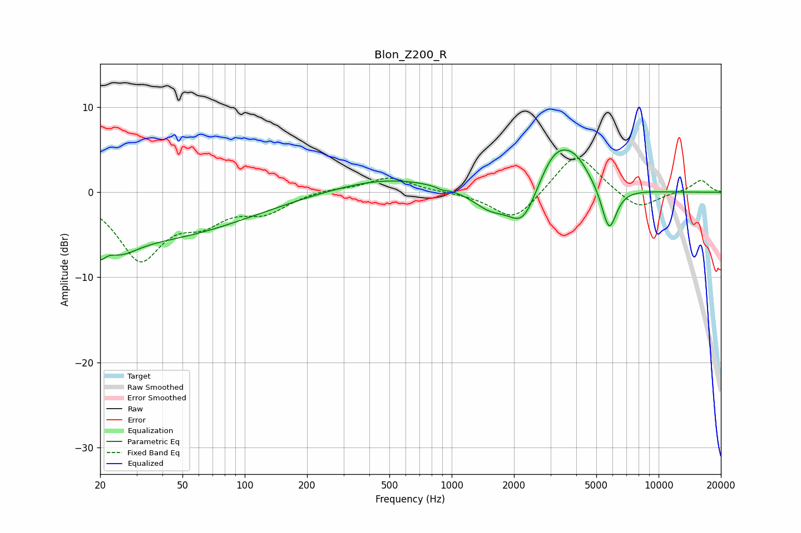

# Blon_Z200_R
See [usage instructions](https://github.com/jaakkopasanen/AutoEq#usage) for more options and info.

### Parametric EQs
Apply preamp of -5.1 dB when using parametric equalizer.

|   # | Type    |   Fc (Hz) |    Q |   Gain (dB) |
|-----|---------|-----------|------|-------------|
|   1 | Peaking |        20 | 5.77 |        -1.9 |
|   2 | Peaking |        25 | 1.63 |        -2.2 |
|   3 | Peaking |        36 | 0.32 |        -5.2 |
|   4 | Peaking |       494 | 0.55 |         1.7 |
|   5 | Peaking |       902 | 5.92 |        -0.3 |
|   6 | Peaking |      1534 | 1.6  |        -2.1 |
|   7 | Peaking |      2223 | 1.94 |        -4.7 |
|   8 | Peaking |      3160 | 1.48 |         5.2 |
|   9 | Peaking |      3988 | 1.94 |         2.2 |
|  10 | Peaking |      5764 | 3.77 |        -5.4 |

### Fixed Band EQs
When using fixed band (also called graphic) equalizer, apply preamp of **-4.1 dB** (if available) and set gains manually with these parameters.

|   # | Type    |   Fc (Hz) |    Q |   Gain (dB) |
|-----|---------|-----------|------|-------------|
|   1 | Peaking |        31 | 1.41 |        -7.6 |
|   2 | Peaking |        62 | 1.41 |        -2.7 |
|   3 | Peaking |       125 | 1.41 |        -2.1 |
|   4 | Peaking |       250 | 1.41 |         0.4 |
|   5 | Peaking |       500 | 1.41 |         1.8 |
|   6 | Peaking |      1000 | 1.41 |         0   |
|   7 | Peaking |      2000 | 1.41 |        -3.5 |
|   8 | Peaking |      4000 | 1.41 |         4.9 |
|   9 | Peaking |      8000 | 1.41 |        -2.2 |
|  10 | Peaking |     16000 | 1.41 |         1.5 |

### Graphs

