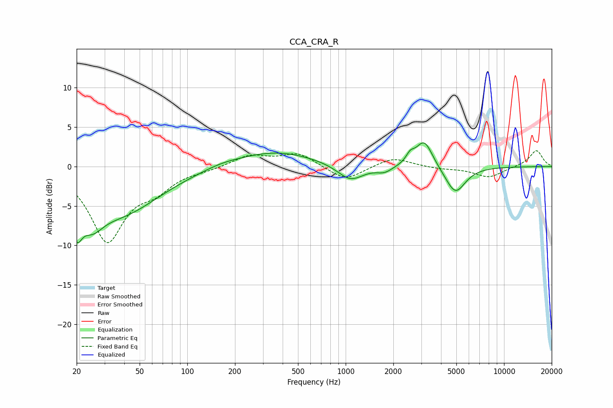

# CCA_CRA_R
See [usage instructions](https://github.com/jaakkopasanen/AutoEq#usage) for more options and info.

### Parametric EQs
Apply preamp of -3.1 dB when using parametric equalizer.

|   # | Type    |   Fc (Hz) |    Q |   Gain (dB) |
|-----|---------|-----------|------|-------------|
|   1 | Peaking |        20 | 4.33 |        -4.2 |
|   2 | Peaking |        25 | 2.01 |        -3.1 |
|   3 | Peaking |        37 | 0.56 |        -5.8 |
|   4 | Peaking |       165 | 1.24 |         0.4 |
|   5 | Peaking |       359 | 0.57 |         1.9 |
|   6 | Peaking |      1072 | 1.72 |        -2.1 |
|   7 | Peaking |      1763 | 2.82 |        -0.7 |
|   8 | Peaking |      2554 | 5.52 |         1   |
|   9 | Peaking |      3132 | 2.63 |         3.5 |
|  10 | Peaking |      4926 | 2.21 |        -3.5 |

### Fixed Band EQs
When using fixed band (also called graphic) equalizer, apply preamp of **-2.1 dB** (if available) and set gains manually with these parameters.

|   # | Type    |   Fc (Hz) |    Q |   Gain (dB) |
|-----|---------|-----------|------|-------------|
|   1 | Peaking |        31 | 1.41 |        -9.2 |
|   2 | Peaking |        62 | 1.41 |        -2.3 |
|   3 | Peaking |       125 | 1.41 |        -0.3 |
|   4 | Peaking |       250 | 1.41 |         1.4 |
|   5 | Peaking |       500 | 1.41 |         1.7 |
|   6 | Peaking |      1000 | 1.41 |        -1.9 |
|   7 | Peaking |      2000 | 1.41 |         1.2 |
|   8 | Peaking |      4000 | 1.41 |        -0.3 |
|   9 | Peaking |      8000 | 1.41 |        -1.4 |
|  10 | Peaking |     16000 | 1.41 |         2.1 |

### Graphs

