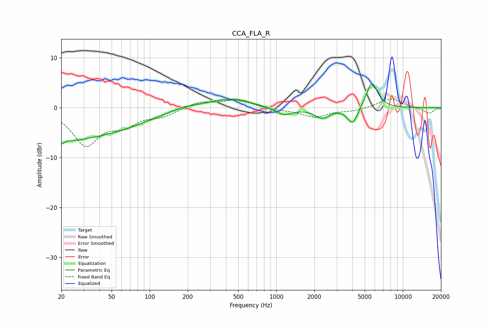

# CCA_FLA_R
See [usage instructions](https://github.com/jaakkopasanen/AutoEq#usage) for more options and info.

### Parametric EQs
Apply preamp of -4.9 dB when using parametric equalizer.

|   # | Type    |   Fc (Hz) |    Q |   Gain (dB) |
|-----|---------|-----------|------|-------------|
|   1 | Peaking |        20 | 5.41 |        -5.1 |
|   2 | Peaking |        20 | 5.75 |         3.3 |
|   3 | Peaking |        24 | 1.18 |        -1.5 |
|   4 | Peaking |        36 | 0.37 |        -5.1 |
|   5 | Peaking |       182 | 1.1  |         0.8 |
|   6 | Peaking |       421 | 0.82 |         1.9 |
|   7 | Peaking |      1149 | 2.07 |        -1.6 |
|   8 | Peaking |      2301 | 2.37 |        -2   |
|   9 | Peaking |      4010 | 3.48 |        -3.5 |
|  10 | Peaking |      5686 | 3.08 |         5.3 |

### Fixed Band EQs
When using fixed band (also called graphic) equalizer, apply preamp of **-1.8 dB** (if available) and set gains manually with these parameters.

|   # | Type    |   Fc (Hz) |    Q |   Gain (dB) |
|-----|---------|-----------|------|-------------|
|   1 | Peaking |        31 | 1.41 |        -7.2 |
|   2 | Peaking |        62 | 1.41 |        -2.9 |
|   3 | Peaking |       125 | 1.41 |        -1.4 |
|   4 | Peaking |       250 | 1.41 |         1.2 |
|   5 | Peaking |       500 | 1.41 |         1.7 |
|   6 | Peaking |      1000 | 1.41 |        -0.4 |
|   7 | Peaking |      2000 | 1.41 |        -1.8 |
|   8 | Peaking |      4000 | 1.41 |        -0.6 |
|   9 | Peaking |      8000 | 1.41 |         1.9 |
|  10 | Peaking |     16000 | 1.41 |        -1.2 |

### Graphs

