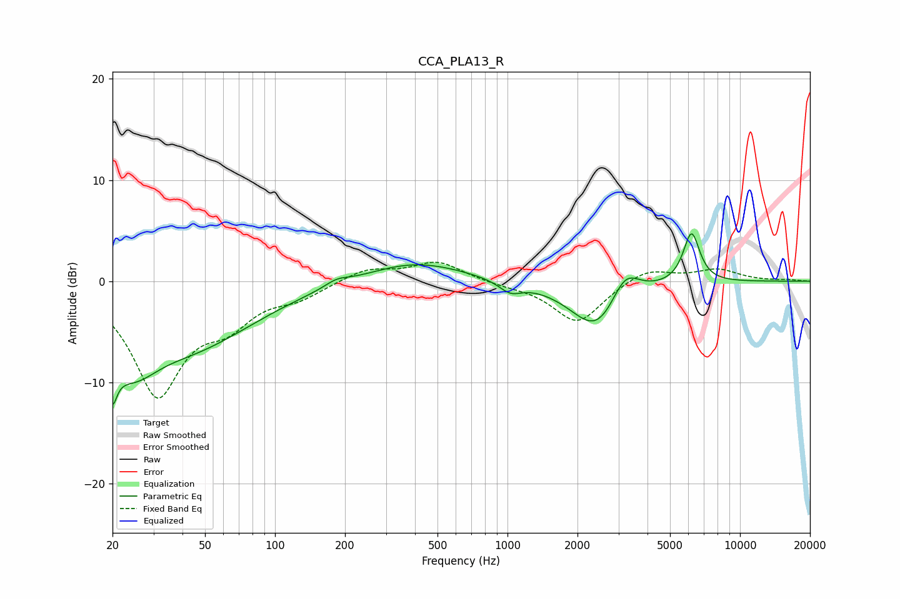

# CCA_PLA13_R
See [usage instructions](https://github.com/jaakkopasanen/AutoEq#usage) for more options and info.

### Parametric EQs
Apply preamp of -4.8 dB when using parametric equalizer.

|   # | Type    |   Fc (Hz) |    Q |   Gain (dB) |
|-----|---------|-----------|------|-------------|
|   1 | Peaking |        20 | 4.57 |        -9.2 |
|   2 | Peaking |        20 | 4.68 |         4   |
|   3 | Peaking |        25 | 1.31 |        -4.6 |
|   4 | Peaking |        44 | 0.51 |        -6   |
|   5 | Peaking |       184 | 2.84 |         0.6 |
|   6 | Peaking |       398 | 0.67 |         2   |
|   7 | Peaking |      1028 | 2.9  |        -1.1 |
|   8 | Peaking |      2442 | 1.26 |        -5.2 |
|   9 | Peaking |      3193 | 2.24 |         3.3 |
|  10 | Peaking |      6185 | 3.89 |         5   |

### Fixed Band EQs
When using fixed band (also called graphic) equalizer, apply preamp of **-2.0 dB** (if available) and set gains manually with these parameters.

|   # | Type    |   Fc (Hz) |    Q |   Gain (dB) |
|-----|---------|-----------|------|-------------|
|   1 | Peaking |        31 | 1.41 |       -10.9 |
|   2 | Peaking |        62 | 1.41 |        -3.2 |
|   3 | Peaking |       125 | 1.41 |        -1.3 |
|   4 | Peaking |       250 | 1.41 |         1.2 |
|   5 | Peaking |       500 | 1.41 |         1.9 |
|   6 | Peaking |      1000 | 1.41 |        -0.3 |
|   7 | Peaking |      2000 | 1.41 |        -4.1 |
|   8 | Peaking |      4000 | 1.41 |         1.4 |
|   9 | Peaking |      8000 | 1.41 |         1.1 |
|  10 | Peaking |     16000 | 1.41 |         0.1 |

### Graphs

