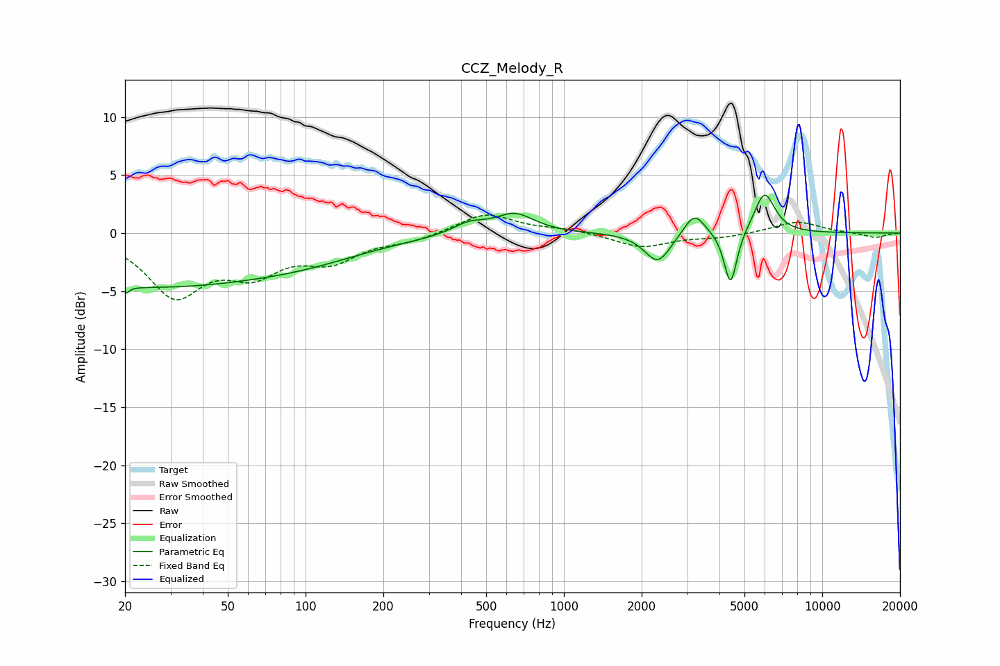

# CCZ_Melody_R
See [usage instructions](https://github.com/jaakkopasanen/AutoEq#usage) for more options and info.

### Parametric EQs
Apply preamp of -3.4 dB when using parametric equalizer.

|   # | Type    |   Fc (Hz) |    Q |   Gain (dB) |
|-----|---------|-----------|------|-------------|
|   1 | Peaking |        20 | 5.9  |        -4.1 |
|   2 | Peaking |        20 | 5.74 |         3.4 |
|   3 | Peaking |        23 | 0.29 |        -4.4 |
|   4 | Peaking |       103 | 0.56 |        -1.3 |
|   5 | Peaking |       429 | 2.18 |         0.9 |
|   6 | Peaking |       645 | 1.87 |         1.7 |
|   7 | Peaking |      2308 | 2.79 |        -2.6 |
|   8 | Peaking |      3198 | 3.48 |         2   |
|   9 | Peaking |      4416 | 5.69 |        -4.8 |
|  10 | Peaking |      5979 | 3.47 |         3.6 |

### Fixed Band EQs
When using fixed band (also called graphic) equalizer, apply preamp of **-1.6 dB** (if available) and set gains manually with these parameters.

|   # | Type    |   Fc (Hz) |    Q |   Gain (dB) |
|-----|---------|-----------|------|-------------|
|   1 | Peaking |        31 | 1.41 |        -5.1 |
|   2 | Peaking |        62 | 1.41 |        -2.9 |
|   3 | Peaking |       125 | 1.41 |        -2.1 |
|   4 | Peaking |       250 | 1.41 |        -0.6 |
|   5 | Peaking |       500 | 1.41 |         1.7 |
|   6 | Peaking |      1000 | 1.41 |         0.3 |
|   7 | Peaking |      2000 | 1.41 |        -1.2 |
|   8 | Peaking |      4000 | 1.41 |        -0.4 |
|   9 | Peaking |      8000 | 1.41 |         1   |
|  10 | Peaking |     16000 | 1.41 |        -0.4 |

### Graphs

