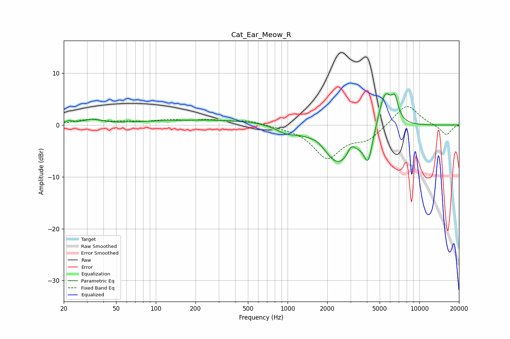

# Cat_Ear_Meow_R
See [usage instructions](https://github.com/jaakkopasanen/AutoEq#usage) for more options and info.

### Parametric EQs
Apply preamp of -6.1 dB when using parametric equalizer.

|   # | Type    |   Fc (Hz) |    Q |   Gain (dB) |
|-----|---------|-----------|------|-------------|
|   1 | Peaking |        22 | 4.62 |         0.5 |
|   2 | Peaking |        33 | 2.17 |         0.9 |
|   3 | Peaking |       337 | 0.2  |         1.1 |
|   4 | Peaking |       971 | 1.76 |        -1.3 |
|   5 | Peaking |      1723 | 2.12 |         1.2 |
|   6 | Peaking |      2424 | 1.04 |        -8   |
|   7 | Peaking |      3041 | 4.96 |         1.8 |
|   8 | Peaking |      4093 | 4.17 |        -5.9 |
|   9 | Peaking |      5495 | 2.57 |         7.5 |
|  10 | Peaking |      6528 | 5.6  |         3.4 |

### Fixed Band EQs
When using fixed band (also called graphic) equalizer, apply preamp of **-3.6 dB** (if available) and set gains manually with these parameters.

|   # | Type    |   Fc (Hz) |    Q |   Gain (dB) |
|-----|---------|-----------|------|-------------|
|   1 | Peaking |        31 | 1.41 |         1   |
|   2 | Peaking |        62 | 1.41 |         0.4 |
|   3 | Peaking |       125 | 1.41 |         0.8 |
|   4 | Peaking |       250 | 1.41 |         0.8 |
|   5 | Peaking |       500 | 1.41 |         0.8 |
|   6 | Peaking |      1000 | 1.41 |        -0.2 |
|   7 | Peaking |      2000 | 1.41 |        -6.2 |
|   8 | Peaking |      4000 | 1.41 |        -2.5 |
|   9 | Peaking |      8000 | 1.41 |         4.2 |
|  10 | Peaking |     16000 | 1.41 |        -2   |

### Graphs

