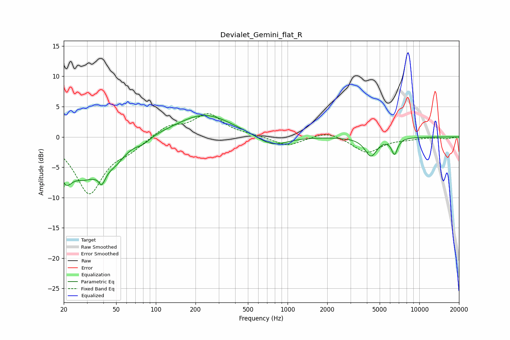

# Devialet_Gemini_flat_R
See [usage instructions](https://github.com/jaakkopasanen/AutoEq#usage) for more options and info.

### Parametric EQs
Apply preamp of -3.6 dB when using parametric equalizer.

|   # | Type    |   Fc (Hz) |    Q |   Gain (dB) |
|-----|---------|-----------|------|-------------|
|   1 | Peaking |        21 | 2.74 |        -4.9 |
|   2 | Peaking |        28 | 1.43 |        -4.9 |
|   3 | Peaking |        37 | 5.72 |         2.9 |
|   4 | Peaking |        38 | 4.37 |        -5.8 |
|   5 | Peaking |        49 | 1.69 |        -2.9 |
|   6 | Peaking |        80 | 2.55 |        -0.9 |
|   7 | Peaking |       235 | 0.68 |         3.8 |
|   8 | Peaking |       760 | 1.24 |        -1.8 |
|   9 | Peaking |      4290 | 3.12 |        -3.1 |
|  10 | Peaking |      6483 | 6    |        -2.6 |

### Fixed Band EQs
When using fixed band (also called graphic) equalizer, apply preamp of **-4.0 dB** (if available) and set gains manually with these parameters.

|   # | Type    |   Fc (Hz) |    Q |   Gain (dB) |
|-----|---------|-----------|------|-------------|
|   1 | Peaking |        31 | 1.41 |        -9.2 |
|   2 | Peaking |        62 | 1.41 |        -1.6 |
|   3 | Peaking |       125 | 1.41 |         1.8 |
|   4 | Peaking |       250 | 1.41 |         3.7 |
|   5 | Peaking |       500 | 1.41 |         0.2 |
|   6 | Peaking |      1000 | 1.41 |        -1.5 |
|   7 | Peaking |      2000 | 1.41 |         1   |
|   8 | Peaking |      4000 | 1.41 |        -2.6 |
|   9 | Peaking |      8000 | 1.41 |        -0.3 |
|  10 | Peaking |     16000 | 1.41 |        -0.3 |

### Graphs

