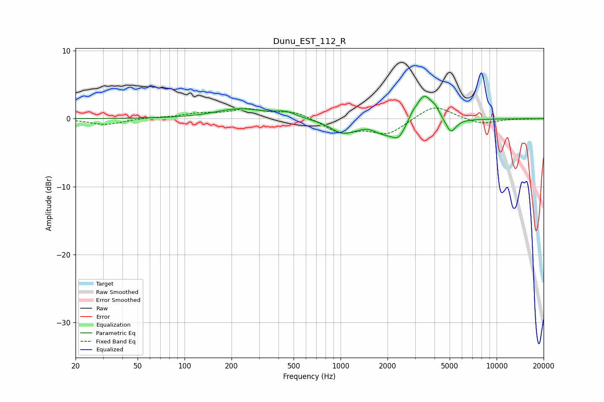

# Dunu_EST_112_R
See [usage instructions](https://github.com/jaakkopasanen/AutoEq#usage) for more options and info.

### Parametric EQs
Apply preamp of -3.4 dB when using parametric equalizer.

|   # | Type    |   Fc (Hz) |    Q |   Gain (dB) |
|-----|---------|-----------|------|-------------|
|   1 | Peaking |       226 | 0.93 |         1.4 |
|   2 | Peaking |       442 | 2.14 |         0.8 |
|   3 | Peaking |      1022 | 1.93 |        -1.6 |
|   4 | Peaking |      1508 | 2.98 |         0.6 |
|   5 | Peaking |      2169 | 0.92 |        -2.9 |
|   6 | Peaking |      2345 | 4.45 |        -1   |
|   7 | Peaking |      2870 | 5.42 |         0.8 |
|   8 | Peaking |      3424 | 2.42 |         4.8 |
|   9 | Peaking |      4070 | 6    |         0.7 |
|  10 | Peaking |      5090 | 4.25 |        -2.1 |

### Fixed Band EQs
When using fixed band (also called graphic) equalizer, apply preamp of **-1.7 dB** (if available) and set gains manually with these parameters.

|   # | Type    |   Fc (Hz) |    Q |   Gain (dB) |
|-----|---------|-----------|------|-------------|
|   1 | Peaking |        31 | 1.41 |        -0.9 |
|   2 | Peaking |        62 | 1.41 |         0.2 |
|   3 | Peaking |       125 | 1.41 |         0.6 |
|   4 | Peaking |       250 | 1.41 |         1.2 |
|   5 | Peaking |       500 | 1.41 |         1.1 |
|   6 | Peaking |      1000 | 1.41 |        -2   |
|   7 | Peaking |      2000 | 1.41 |        -2.2 |
|   8 | Peaking |      4000 | 1.41 |         2.1 |
|   9 | Peaking |      8000 | 1.41 |        -0.8 |
|  10 | Peaking |     16000 | 1.41 |        -0   |

### Graphs

