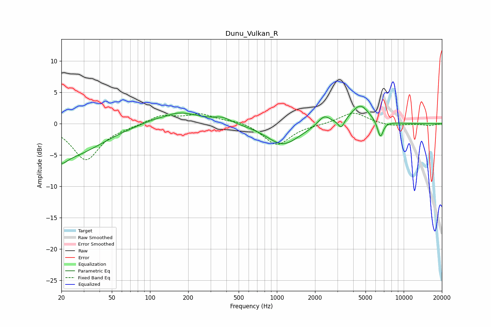

# Dunu_Vulkan_R
See [usage instructions](https://github.com/jaakkopasanen/AutoEq#usage) for more options and info.

### Parametric EQs
Apply preamp of -2.9 dB when using parametric equalizer.

|   # | Type    |   Fc (Hz) |    Q |   Gain (dB) |
|-----|---------|-----------|------|-------------|
|   1 | Peaking |        20 | 3.34 |        -1.4 |
|   2 | Peaking |        23 | 0.56 |        -5.1 |
|   3 | Peaking |       133 | 2.28 |        -0.3 |
|   4 | Peaking |       158 | 0.8  |         2.2 |
|   5 | Peaking |       373 | 2.16 |         0.8 |
|   6 | Peaking |      1118 | 1.11 |        -3.4 |
|   7 | Peaking |      2357 | 2.92 |         1.6 |
|   8 | Peaking |      3219 | 5.84 |        -1.4 |
|   9 | Peaking |      4543 | 1.93 |         3.1 |
|  10 | Peaking |      6547 | 5.88 |        -2.7 |

### Fixed Band EQs
When using fixed band (also called graphic) equalizer, apply preamp of **-1.8 dB** (if available) and set gains manually with these parameters.

|   # | Type    |   Fc (Hz) |    Q |   Gain (dB) |
|-----|---------|-----------|------|-------------|
|   1 | Peaking |        31 | 1.41 |        -5.7 |
|   2 | Peaking |        62 | 1.41 |        -0.3 |
|   3 | Peaking |       125 | 1.41 |         1.3 |
|   4 | Peaking |       250 | 1.41 |         1.4 |
|   5 | Peaking |       500 | 1.41 |         0.5 |
|   6 | Peaking |      1000 | 1.41 |        -3.5 |
|   7 | Peaking |      2000 | 1.41 |        -0.1 |
|   8 | Peaking |      4000 | 1.41 |         1.9 |
|   9 | Peaking |      8000 | 1.41 |        -0.4 |
|  10 | Peaking |     16000 | 1.41 |        -0.3 |

### Graphs

