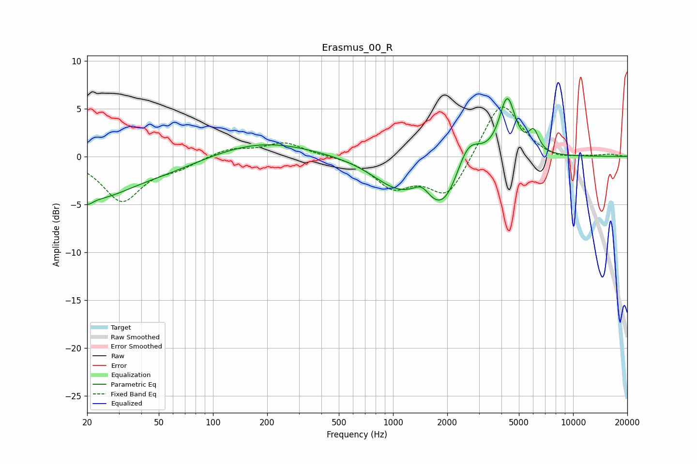

# Erasmus_00_R
See [usage instructions](https://github.com/jaakkopasanen/AutoEq#usage) for more options and info.

### Parametric EQs
Apply preamp of -6.1 dB when using parametric equalizer.

|   # | Type    |   Fc (Hz) |    Q |   Gain (dB) |
|-----|---------|-----------|------|-------------|
|   1 | Peaking |        20 | 5.01 |        -0.8 |
|   2 | Peaking |        22 | 0.65 |        -4.1 |
|   3 | Peaking |        58 | 0.7  |        -0.9 |
|   4 | Peaking |       191 | 0.52 |         1.6 |
|   5 | Peaking |      1031 | 1.03 |        -2.4 |
|   6 | Peaking |      1444 | 3.05 |         1.3 |
|   7 | Peaking |      1918 | 1.22 |        -5.7 |
|   8 | Peaking |      2592 | 1.95 |         4.1 |
|   9 | Peaking |      4308 | 3.1  |         6.2 |
|  10 | Peaking |      6041 | 4.69 |         2.1 |

### Fixed Band EQs
When using fixed band (also called graphic) equalizer, apply preamp of **-5.3 dB** (if available) and set gains manually with these parameters.

|   # | Type    |   Fc (Hz) |    Q |   Gain (dB) |
|-----|---------|-----------|------|-------------|
|   1 | Peaking |        31 | 1.41 |        -4.6 |
|   2 | Peaking |        62 | 1.41 |        -1   |
|   3 | Peaking |       125 | 1.41 |         0.8 |
|   4 | Peaking |       250 | 1.41 |         1.4 |
|   5 | Peaking |       500 | 1.41 |         0.1 |
|   6 | Peaking |      1000 | 1.41 |        -3   |
|   7 | Peaking |      2000 | 1.41 |        -4.2 |
|   8 | Peaking |      4000 | 1.41 |         6.1 |
|   9 | Peaking |      8000 | 1.41 |        -0.5 |
|  10 | Peaking |     16000 | 1.41 |         0.2 |

### Graphs

