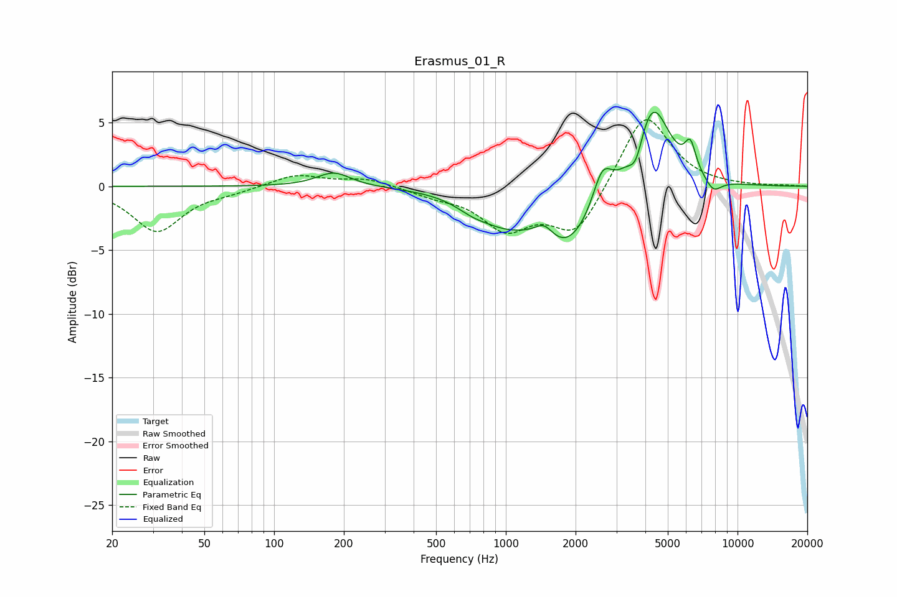

# Erasmus_01_R
See [usage instructions](https://github.com/jaakkopasanen/AutoEq#usage) for more options and info.

### Parametric EQs
Apply preamp of -5.9 dB when using parametric equalizer.

|   # | Type    |   Fc (Hz) |    Q |   Gain (dB) |
|-----|---------|-----------|------|-------------|
|   1 | Peaking |       181 | 1.94 |         1.1 |
|   2 | Peaking |       715 | 1.98 |        -0.6 |
|   3 | Peaking |       980 | 1.16 |        -1.9 |
|   4 | Peaking |      1467 | 3.36 |         1.2 |
|   5 | Peaking |      1825 | 1.08 |        -4.7 |
|   6 | Peaking |      2607 | 3.44 |         2.8 |
|   7 | Peaking |      3647 | 4.71 |        -1.9 |
|   8 | Peaking |      4278 | 1.82 |         6.9 |
|   9 | Peaking |      6259 | 5.72 |         2.2 |
|  10 | Peaking |      7853 | 3.71 |        -1.1 |

### Fixed Band EQs
When using fixed band (also called graphic) equalizer, apply preamp of **-5.3 dB** (if available) and set gains manually with these parameters.

|   # | Type    |   Fc (Hz) |    Q |   Gain (dB) |
|-----|---------|-----------|------|-------------|
|   1 | Peaking |        31 | 1.41 |        -3.5 |
|   2 | Peaking |        62 | 1.41 |        -0.3 |
|   3 | Peaking |       125 | 1.41 |         0.9 |
|   4 | Peaking |       250 | 1.41 |         0.6 |
|   5 | Peaking |       500 | 1.41 |        -0.6 |
|   6 | Peaking |      1000 | 1.41 |        -3.1 |
|   7 | Peaking |      2000 | 1.41 |        -3.8 |
|   8 | Peaking |      4000 | 1.41 |         6   |
|   9 | Peaking |      8000 | 1.41 |         0   |
|  10 | Peaking |     16000 | 1.41 |         0.1 |

### Graphs

