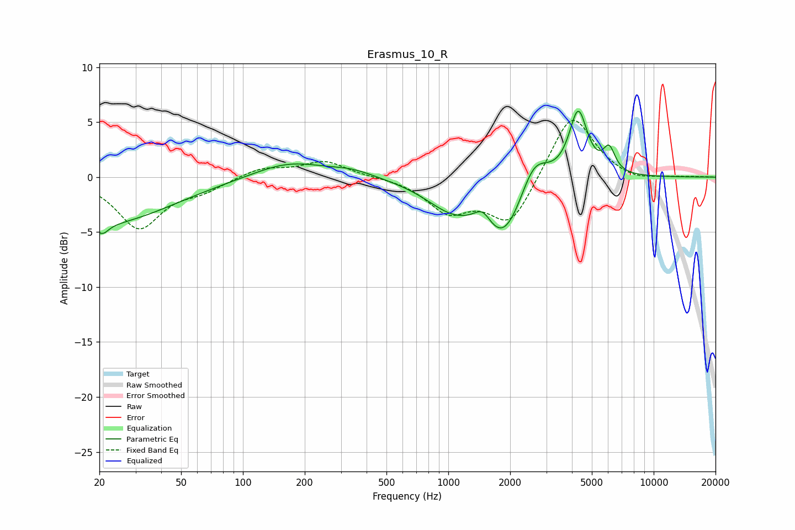

# Erasmus_10_R
See [usage instructions](https://github.com/jaakkopasanen/AutoEq#usage) for more options and info.

### Parametric EQs
Apply preamp of -6.1 dB when using parametric equalizer.

|   # | Type    |   Fc (Hz) |    Q |   Gain (dB) |
|-----|---------|-----------|------|-------------|
|   1 | Peaking |        21 | 4.65 |        -1   |
|   2 | Peaking |        21 | 0.44 |        -4.2 |
|   3 | Peaking |       167 | 0.82 |         1.5 |
|   4 | Peaking |       340 | 1.3  |         0.6 |
|   5 | Peaking |      1046 | 1.07 |        -2.5 |
|   6 | Peaking |      1469 | 3.44 |         1.4 |
|   7 | Peaking |      1868 | 1.38 |        -5.3 |
|   8 | Peaking |      2612 | 2.05 |         3.3 |
|   9 | Peaking |      4291 | 3.15 |         6.1 |
|  10 | Peaking |      6070 | 4.73 |         2.1 |

### Fixed Band EQs
When using fixed band (also called graphic) equalizer, apply preamp of **-5.3 dB** (if available) and set gains manually with these parameters.

|   # | Type    |   Fc (Hz) |    Q |   Gain (dB) |
|-----|---------|-----------|------|-------------|
|   1 | Peaking |        31 | 1.41 |        -4.6 |
|   2 | Peaking |        62 | 1.41 |        -1   |
|   3 | Peaking |       125 | 1.41 |         0.9 |
|   4 | Peaking |       250 | 1.41 |         1.4 |
|   5 | Peaking |       500 | 1.41 |         0   |
|   6 | Peaking |      1000 | 1.41 |        -2.9 |
|   7 | Peaking |      2000 | 1.41 |        -4.3 |
|   8 | Peaking |      4000 | 1.41 |         6.1 |
|   9 | Peaking |      8000 | 1.41 |        -0.5 |
|  10 | Peaking |     16000 | 1.41 |         0   |

### Graphs

