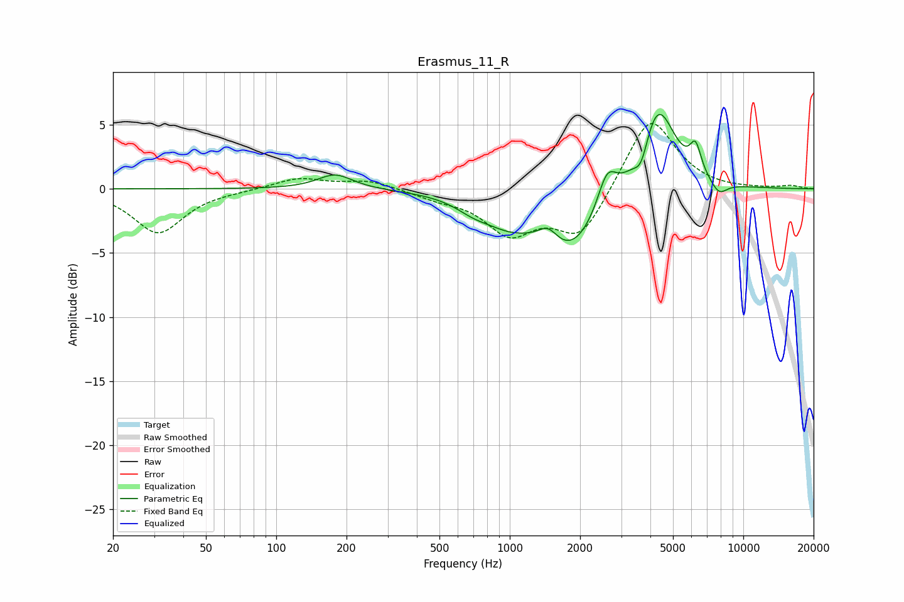

# Erasmus_11_R
See [usage instructions](https://github.com/jaakkopasanen/AutoEq#usage) for more options and info.

### Parametric EQs
Apply preamp of -5.9 dB when using parametric equalizer.

|   # | Type    |   Fc (Hz) |    Q |   Gain (dB) |
|-----|---------|-----------|------|-------------|
|   1 | Peaking |       179 | 1.89 |         1.2 |
|   2 | Peaking |       694 | 1.95 |        -0.6 |
|   3 | Peaking |       985 | 1.18 |        -1.9 |
|   4 | Peaking |      1462 | 3.34 |         1.2 |
|   5 | Peaking |      1825 | 1.07 |        -4.7 |
|   6 | Peaking |      2608 | 3.45 |         2.8 |
|   7 | Peaking |      3658 | 4.62 |        -1.9 |
|   8 | Peaking |      4285 | 1.83 |         7   |
|   9 | Peaking |      6248 | 5.66 |         2.2 |
|  10 | Peaking |      7857 | 3.71 |        -1.1 |

### Fixed Band EQs
When using fixed band (also called graphic) equalizer, apply preamp of **-5.2 dB** (if available) and set gains manually with these parameters.

|   # | Type    |   Fc (Hz) |    Q |   Gain (dB) |
|-----|---------|-----------|------|-------------|
|   1 | Peaking |        31 | 1.41 |        -3.4 |
|   2 | Peaking |        62 | 1.41 |        -0.1 |
|   3 | Peaking |       125 | 1.41 |         0.9 |
|   4 | Peaking |       250 | 1.41 |         0.7 |
|   5 | Peaking |       500 | 1.41 |        -0.6 |
|   6 | Peaking |      1000 | 1.41 |        -3.3 |
|   7 | Peaking |      2000 | 1.41 |        -3.8 |
|   8 | Peaking |      4000 | 1.41 |         5.8 |
|   9 | Peaking |      8000 | 1.41 |        -0.1 |
|  10 | Peaking |     16000 | 1.41 |         0.2 |

### Graphs

