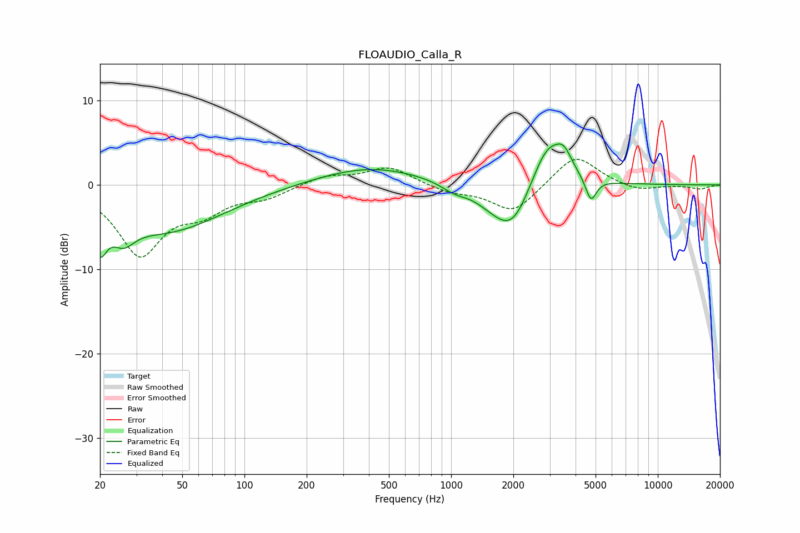

# FLOAUDIO_Calla_R
See [usage instructions](https://github.com/jaakkopasanen/AutoEq#usage) for more options and info.

### Parametric EQs
Apply preamp of -4.9 dB when using parametric equalizer.

|   # | Type    |   Fc (Hz) |    Q |   Gain (dB) |
|-----|---------|-----------|------|-------------|
|   1 | Peaking |        20 | 4.35 |        -4.4 |
|   2 | Peaking |        26 | 2.64 |        -2.5 |
|   3 | Peaking |        41 | 0.5  |        -5.4 |
|   4 | Peaking |       407 | 0.55 |         2.2 |
|   5 | Peaking |      1033 | 2.29 |        -0.9 |
|   6 | Peaking |      1642 | 1.36 |        -1.8 |
|   7 | Peaking |      2001 | 1.62 |        -4.7 |
|   8 | Peaking |      2937 | 1.69 |         5.7 |
|   9 | Peaking |      3514 | 3.7  |         2   |
|  10 | Peaking |      4749 | 5.35 |        -2.8 |

### Fixed Band EQs
When using fixed band (also called graphic) equalizer, apply preamp of **-3.1 dB** (if available) and set gains manually with these parameters.

|   # | Type    |   Fc (Hz) |    Q |   Gain (dB) |
|-----|---------|-----------|------|-------------|
|   1 | Peaking |        31 | 1.41 |        -8.1 |
|   2 | Peaking |        62 | 1.41 |        -2.6 |
|   3 | Peaking |       125 | 1.41 |        -1.3 |
|   4 | Peaking |       250 | 1.41 |         1.1 |
|   5 | Peaking |       500 | 1.41 |         2.1 |
|   6 | Peaking |      1000 | 1.41 |        -0.8 |
|   7 | Peaking |      2000 | 1.41 |        -3.3 |
|   8 | Peaking |      4000 | 1.41 |         3.7 |
|   9 | Peaking |      8000 | 1.41 |        -0.8 |
|  10 | Peaking |     16000 | 1.41 |        -0.5 |

### Graphs

