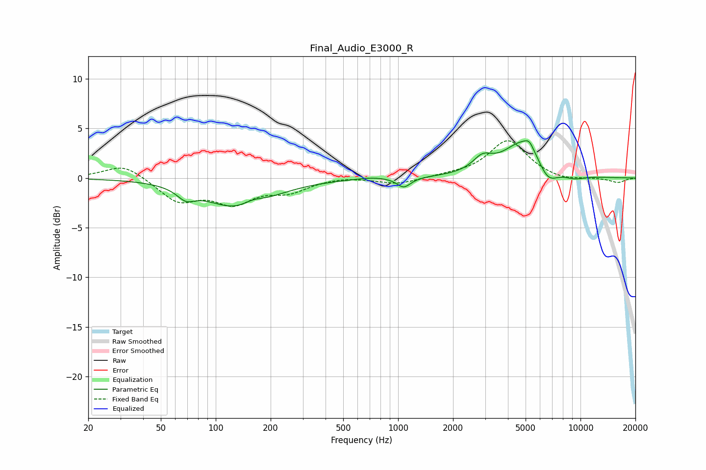

# Final_Audio_E3000_R
See [usage instructions](https://github.com/jaakkopasanen/AutoEq#usage) for more options and info.

### Parametric EQs
Apply preamp of -3.9 dB when using parametric equalizer.

|   # | Type    |   Fc (Hz) |    Q |   Gain (dB) |
|-----|---------|-----------|------|-------------|
|   1 | Peaking |        69 | 2.99 |        -1.1 |
|   2 | Peaking |       134 | 0.79 |        -3.1 |
|   3 | Peaking |       160 | 2.33 |         0.7 |
|   4 | Peaking |       721 | 1.7  |         0.2 |
|   5 | Peaking |      1074 | 3.74 |        -1   |
|   6 | Peaking |      2899 | 2.7  |         1.3 |
|   7 | Peaking |      4915 | 1.25 |         3.8 |
|   8 | Peaking |      5235 | 5.9  |         0.7 |
|   9 | Peaking |      6598 | 2.42 |        -2   |
|  10 | Peaking |      9243 | 2.06 |        -0.5 |

### Fixed Band EQs
When using fixed band (also called graphic) equalizer, apply preamp of **-3.8 dB** (if available) and set gains manually with these parameters.

|   # | Type    |   Fc (Hz) |    Q |   Gain (dB) |
|-----|---------|-----------|------|-------------|
|   1 | Peaking |        31 | 1.41 |         1.5 |
|   2 | Peaking |        62 | 1.41 |        -2.3 |
|   3 | Peaking |       125 | 1.41 |        -2.3 |
|   4 | Peaking |       250 | 1.41 |        -1.2 |
|   5 | Peaking |       500 | 1.41 |         0.2 |
|   6 | Peaking |      1000 | 1.41 |        -0.6 |
|   7 | Peaking |      2000 | 1.41 |         0.2 |
|   8 | Peaking |      4000 | 1.41 |         3.8 |
|   9 | Peaking |      8000 | 1.41 |        -0.3 |
|  10 | Peaking |     16000 | 1.41 |        -0.5 |

### Graphs

