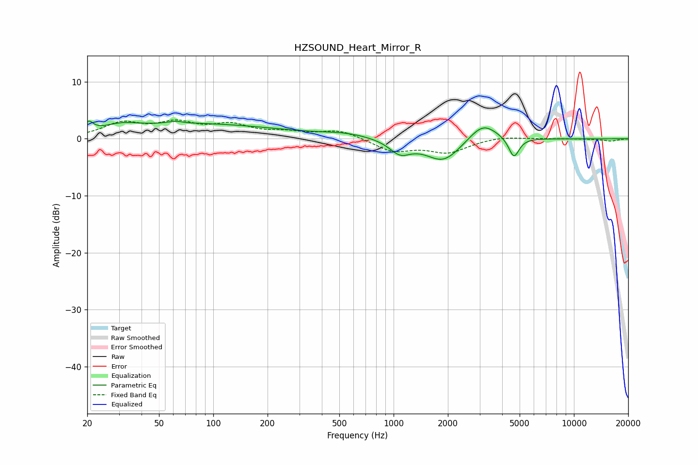

# HZSOUND_Heart_Mirror_R
See [usage instructions](https://github.com/jaakkopasanen/AutoEq#usage) for more options and info.

### Parametric EQs
Apply preamp of -3.2 dB when using parametric equalizer.

|   # | Type    |   Fc (Hz) |    Q |   Gain (dB) |
|-----|---------|-----------|------|-------------|
|   1 | Peaking |        20 | 5.84 |         1.7 |
|   2 | Peaking |        31 | 1.49 |         1.1 |
|   3 | Peaking |        67 | 2.85 |         3   |
|   4 | Peaking |        67 | 3.02 |        -2.7 |
|   5 | Peaking |        86 | 0.31 |         2.5 |
|   6 | Peaking |       544 | 1.02 |         0.7 |
|   7 | Peaking |      1086 | 2.43 |        -2.3 |
|   8 | Peaking |      1889 | 1.45 |        -4.1 |
|   9 | Peaking |      3129 | 1.78 |         3.3 |
|  10 | Peaking |      4646 | 4.86 |        -3.6 |

### Fixed Band EQs
When using fixed band (also called graphic) equalizer, apply preamp of **-3.4 dB** (if available) and set gains manually with these parameters.

|   # | Type    |   Fc (Hz) |    Q |   Gain (dB) |
|-----|---------|-----------|------|-------------|
|   1 | Peaking |        31 | 1.41 |         2.5 |
|   2 | Peaking |        62 | 1.41 |         2.4 |
|   3 | Peaking |       125 | 1.41 |         2.1 |
|   4 | Peaking |       250 | 1.41 |         0.9 |
|   5 | Peaking |       500 | 1.41 |         1.5 |
|   6 | Peaking |      1000 | 1.41 |        -2.1 |
|   7 | Peaking |      2000 | 1.41 |        -2.3 |
|   8 | Peaking |      4000 | 1.41 |         0.5 |
|   9 | Peaking |      8000 | 1.41 |         0   |
|  10 | Peaking |     16000 | 1.41 |        -0.4 |

### Graphs

