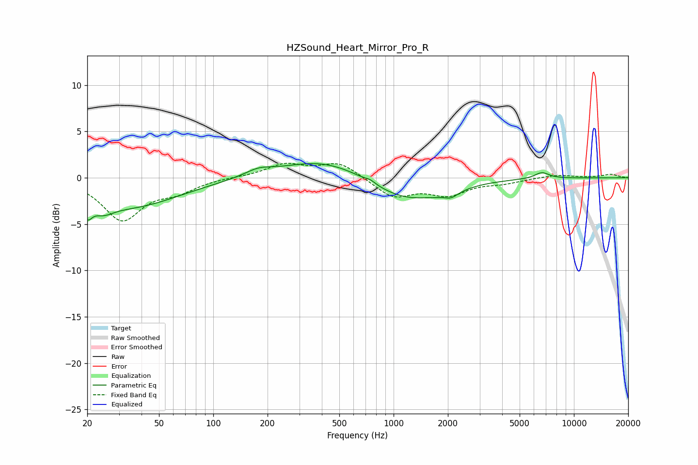

# HZSound_Heart_Mirror_Pro_R
See [usage instructions](https://github.com/jaakkopasanen/AutoEq#usage) for more options and info.

### Parametric EQs
Apply preamp of -1.6 dB when using parametric equalizer.

|   # | Type    |   Fc (Hz) |    Q |   Gain (dB) |
|-----|---------|-----------|------|-------------|
|   1 | Peaking |        20 | 5.53 |        -1.7 |
|   2 | Peaking |        25 | 2.55 |        -1   |
|   3 | Peaking |        34 | 0.5  |        -3.1 |
|   4 | Peaking |       178 | 1.95 |         0.6 |
|   5 | Peaking |       421 | 0.58 |         2.1 |
|   6 | Peaking |       743 | 5.93 |         0.3 |
|   7 | Peaking |      1141 | 0.71 |        -2.6 |
|   8 | Peaking |      1986 | 1.47 |        -0.6 |
|   9 | Peaking |      2092 | 4.27 |        -0.4 |
|  10 | Peaking |      6644 | 3.44 |         0.7 |

### Fixed Band EQs
When using fixed band (also called graphic) equalizer, apply preamp of **-1.7 dB** (if available) and set gains manually with these parameters.

|   # | Type    |   Fc (Hz) |    Q |   Gain (dB) |
|-----|---------|-----------|------|-------------|
|   1 | Peaking |        31 | 1.41 |        -4.4 |
|   2 | Peaking |        62 | 1.41 |        -1.2 |
|   3 | Peaking |       125 | 1.41 |         0.1 |
|   4 | Peaking |       250 | 1.41 |         1.4 |
|   5 | Peaking |       500 | 1.41 |         1.6 |
|   6 | Peaking |      1000 | 1.41 |        -2.1 |
|   7 | Peaking |      2000 | 1.41 |        -1.7 |
|   8 | Peaking |      4000 | 1.41 |        -0.5 |
|   9 | Peaking |      8000 | 1.41 |         0.3 |
|  10 | Peaking |     16000 | 1.41 |         0.4 |

### Graphs

