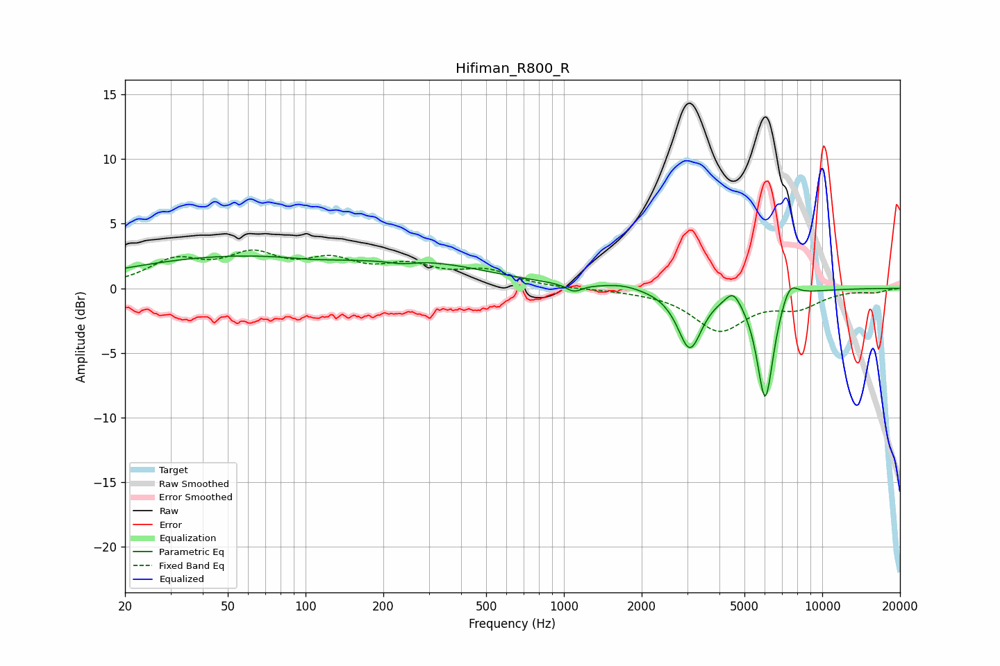

# Hifiman_R800_R
See [usage instructions](https://github.com/jaakkopasanen/AutoEq#usage) for more options and info.

### Parametric EQs
Apply preamp of -2.6 dB when using parametric equalizer.

|   # | Type    |   Fc (Hz) |    Q |   Gain (dB) |
|-----|---------|-----------|------|-------------|
|   1 | Peaking |        52 | 0.33 |         2.4 |
|   2 | Peaking |       104 | 1.85 |        -0.1 |
|   3 | Peaking |       235 | 2.78 |        -0.3 |
|   4 | Peaking |       308 | 0.58 |         1.5 |
|   5 | Peaking |      1094 | 4.67 |        -0.6 |
|   6 | Peaking |      1683 | 1.89 |         0.3 |
|   7 | Peaking |      3071 | 3.05 |        -4.6 |
|   8 | Peaking |      4523 | 4.72 |         1.1 |
|   9 | Peaking |      6018 | 4.18 |        -8.6 |
|  10 | Peaking |      7467 | 4    |         1.5 |

### Fixed Band EQs
When using fixed band (also called graphic) equalizer, apply preamp of **-3.1 dB** (if available) and set gains manually with these parameters.

|   # | Type    |   Fc (Hz) |    Q |   Gain (dB) |
|-----|---------|-----------|------|-------------|
|   1 | Peaking |        31 | 1.41 |         1.9 |
|   2 | Peaking |        62 | 1.41 |         2.2 |
|   3 | Peaking |       125 | 1.41 |         1.8 |
|   4 | Peaking |       250 | 1.41 |         1.4 |
|   5 | Peaking |       500 | 1.41 |         1.2 |
|   6 | Peaking |      1000 | 1.41 |        -0   |
|   7 | Peaking |      2000 | 1.41 |        -0.1 |
|   8 | Peaking |      4000 | 1.41 |        -3.1 |
|   9 | Peaking |      8000 | 1.41 |        -1.3 |
|  10 | Peaking |     16000 | 1.41 |        -0.3 |

### Graphs

