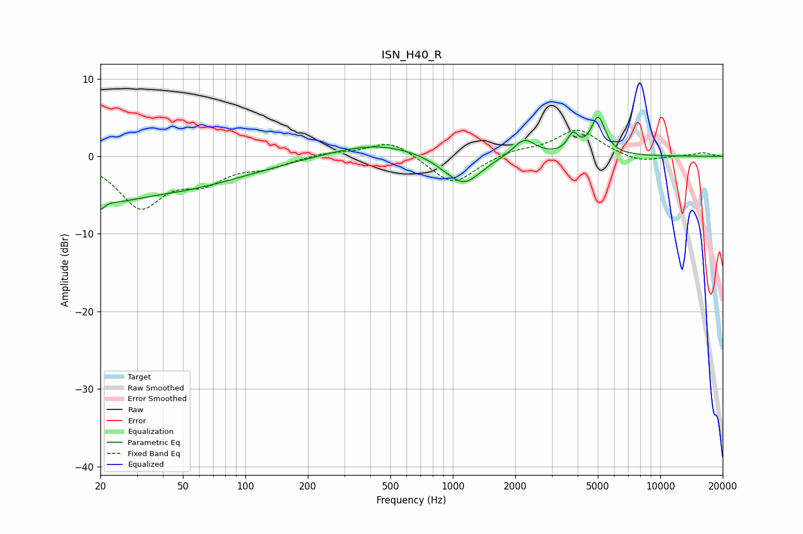

# ISN_H40_R
See [usage instructions](https://github.com/jaakkopasanen/AutoEq#usage) for more options and info.

### Parametric EQs
Apply preamp of -5.1 dB when using parametric equalizer.

|   # | Type    |   Fc (Hz) |    Q |   Gain (dB) |
|-----|---------|-----------|------|-------------|
|   1 | Peaking |        20 | 5.96 |        -4.9 |
|   2 | Peaking |        20 | 5.8  |         3.3 |
|   3 | Peaking |        23 | 1.32 |        -1.3 |
|   4 | Peaking |        34 | 0.32 |        -4.6 |
|   5 | Peaking |       423 | 0.66 |         1.7 |
|   6 | Peaking |       937 | 1.62 |        -0.7 |
|   7 | Peaking |      1140 | 1.73 |        -3.4 |
|   8 | Peaking |      2211 | 2.67 |         2.3 |
|   9 | Peaking |      3793 | 5.35 |         2.3 |
|  10 | Peaking |      5020 | 4.06 |         4.8 |

### Fixed Band EQs
When using fixed band (also called graphic) equalizer, apply preamp of **-3.5 dB** (if available) and set gains manually with these parameters.

|   # | Type    |   Fc (Hz) |    Q |   Gain (dB) |
|-----|---------|-----------|------|-------------|
|   1 | Peaking |        31 | 1.41 |        -6.3 |
|   2 | Peaking |        62 | 1.41 |        -2.7 |
|   3 | Peaking |       125 | 1.41 |        -1.2 |
|   4 | Peaking |       250 | 1.41 |         0.5 |
|   5 | Peaking |       500 | 1.41 |         2.1 |
|   6 | Peaking |      1000 | 1.41 |        -3.8 |
|   7 | Peaking |      2000 | 1.41 |         0.8 |
|   8 | Peaking |      4000 | 1.41 |         3.5 |
|   9 | Peaking |      8000 | 1.41 |        -0.9 |
|  10 | Peaking |     16000 | 1.41 |         0.5 |

### Graphs

