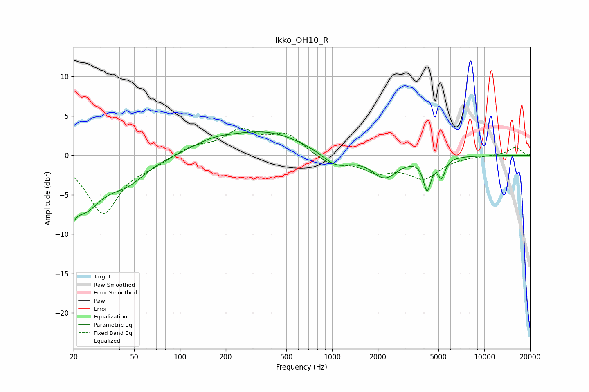

# Ikko_OH10_R
See [usage instructions](https://github.com/jaakkopasanen/AutoEq#usage) for more options and info.

### Parametric EQs
Apply preamp of -3.1 dB when using parametric equalizer.

|   # | Type    |   Fc (Hz) |    Q |   Gain (dB) |
|-----|---------|-----------|------|-------------|
|   1 | Peaking |        20 | 4.71 |        -6.6 |
|   2 | Peaking |        20 | 5.26 |         3.7 |
|   3 | Peaking |        24 | 1.26 |        -5.6 |
|   4 | Peaking |        45 | 1.09 |        -2.8 |
|   5 | Peaking |       165 | 0.99 |         1.2 |
|   6 | Peaking |       371 | 0.57 |         2.8 |
|   7 | Peaking |      1055 | 1.57 |        -1.8 |
|   8 | Peaking |      2215 | 1.66 |        -2.8 |
|   9 | Peaking |      4208 | 5.75 |        -3.9 |
|  10 | Peaking |      5245 | 6    |        -2.3 |

### Fixed Band EQs
When using fixed band (also called graphic) equalizer, apply preamp of **-3.5 dB** (if available) and set gains manually with these parameters.

|   # | Type    |   Fc (Hz) |    Q |   Gain (dB) |
|-----|---------|-----------|------|-------------|
|   1 | Peaking |        31 | 1.41 |        -7.3 |
|   2 | Peaking |        62 | 1.41 |        -0.9 |
|   3 | Peaking |       125 | 1.41 |         1.1 |
|   4 | Peaking |       250 | 1.41 |         2.9 |
|   5 | Peaking |       500 | 1.41 |         2.5 |
|   6 | Peaking |      1000 | 1.41 |        -1.2 |
|   7 | Peaking |      2000 | 1.41 |        -1.8 |
|   8 | Peaking |      4000 | 1.41 |        -2.7 |
|   9 | Peaking |      8000 | 1.41 |        -0   |
|  10 | Peaking |     16000 | 1.41 |         1   |

### Graphs

