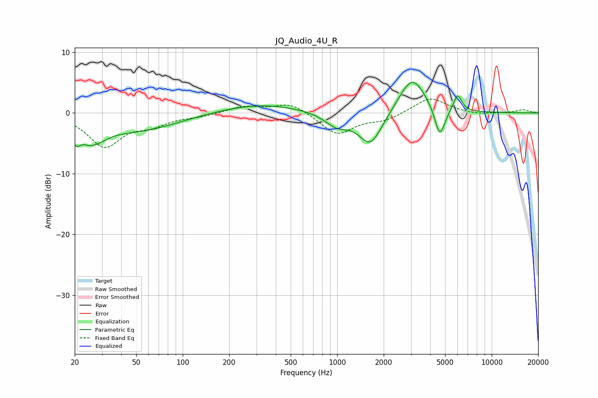

# JQ_Audio_4U_R
See [usage instructions](https://github.com/jaakkopasanen/AutoEq#usage) for more options and info.

### Parametric EQs
Apply preamp of -5.1 dB when using parametric equalizer.

|   # | Type    |   Fc (Hz) |    Q |   Gain (dB) |
|-----|---------|-----------|------|-------------|
|   1 | Peaking |        20 | 4.99 |        -2.4 |
|   2 | Peaking |        26 | 2.07 |        -5   |
|   3 | Peaking |        27 | 2.99 |         1.7 |
|   4 | Peaking |        51 | 0.53 |        -2.8 |
|   5 | Peaking |       314 | 0.53 |         1.5 |
|   6 | Peaking |       989 | 1.83 |        -2.1 |
|   7 | Peaking |      1645 | 1.82 |        -5.5 |
|   8 | Peaking |      3056 | 1.62 |         6.2 |
|   9 | Peaking |      4617 | 4.13 |        -5.1 |
|  10 | Peaking |      6014 | 5.15 |         2.9 |

### Fixed Band EQs
When using fixed band (also called graphic) equalizer, apply preamp of **-2.4 dB** (if available) and set gains manually with these parameters.

|   # | Type    |   Fc (Hz) |    Q |   Gain (dB) |
|-----|---------|-----------|------|-------------|
|   1 | Peaking |        31 | 1.41 |        -5.4 |
|   2 | Peaking |        62 | 1.41 |        -1.6 |
|   3 | Peaking |       125 | 1.41 |        -0.5 |
|   4 | Peaking |       250 | 1.41 |         1.1 |
|   5 | Peaking |       500 | 1.41 |         1.7 |
|   6 | Peaking |      1000 | 1.41 |        -3.6 |
|   7 | Peaking |      2000 | 1.41 |        -1.1 |
|   8 | Peaking |      4000 | 1.41 |         2.6 |
|   9 | Peaking |      8000 | 1.41 |        -0.3 |
|  10 | Peaking |     16000 | 1.41 |         0.5 |

### Graphs

