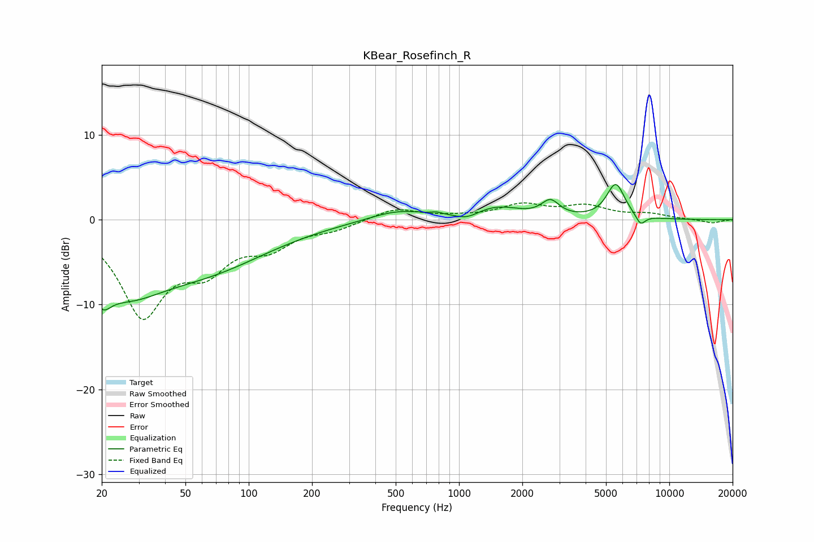

# KBear_Rosefinch_R
See [usage instructions](https://github.com/jaakkopasanen/AutoEq#usage) for more options and info.

### Parametric EQs
Apply preamp of -4.3 dB when using parametric equalizer.

|   # | Type    |   Fc (Hz) |    Q |   Gain (dB) |
|-----|---------|-----------|------|-------------|
|   1 | Peaking |        20 | 3.37 |        -3.1 |
|   2 | Peaking |        25 | 0.74 |        -6.5 |
|   3 | Peaking |        64 | 0.47 |        -4.9 |
|   4 | Peaking |       512 | 1.02 |         1.2 |
|   5 | Peaking |       784 | 5.81 |         0.2 |
|   6 | Peaking |      1092 | 2.6  |        -0.7 |
|   7 | Peaking |      1517 | 1.26 |         1.4 |
|   8 | Peaking |      2719 | 3.38 |         1.8 |
|   9 | Peaking |      5561 | 3.19 |         4.1 |
|  10 | Peaking |      7297 | 5.74 |        -1.2 |

### Fixed Band EQs
When using fixed band (also called graphic) equalizer, apply preamp of **-2.1 dB** (if available) and set gains manually with these parameters.

|   # | Type    |   Fc (Hz) |    Q |   Gain (dB) |
|-----|---------|-----------|------|-------------|
|   1 | Peaking |        31 | 1.41 |       -10.8 |
|   2 | Peaking |        62 | 1.41 |        -4.6 |
|   3 | Peaking |       125 | 1.41 |        -2.7 |
|   4 | Peaking |       250 | 1.41 |        -0.9 |
|   5 | Peaking |       500 | 1.41 |         1.4 |
|   6 | Peaking |      1000 | 1.41 |         0.3 |
|   7 | Peaking |      2000 | 1.41 |         1.6 |
|   8 | Peaking |      4000 | 1.41 |         1.5 |
|   9 | Peaking |      8000 | 1.41 |         0.6 |
|  10 | Peaking |     16000 | 1.41 |        -0.4 |

### Graphs

