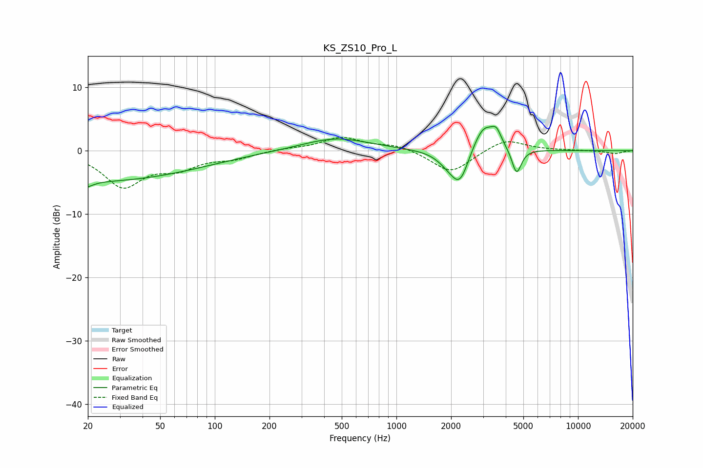

# KS_ZS10_Pro_L
See [usage instructions](https://github.com/jaakkopasanen/AutoEq#usage) for more options and info.

### Parametric EQs
Apply preamp of -3.9 dB when using parametric equalizer.

|   # | Type    |   Fc (Hz) |    Q |   Gain (dB) |
|-----|---------|-----------|------|-------------|
|   1 | Peaking |        20 | 5.46 |        -4.2 |
|   2 | Peaking |        20 | 5.96 |         3.3 |
|   3 | Peaking |        22 | 0.24 |        -4.8 |
|   4 | Peaking |        82 | 2.41 |        -0   |
|   5 | Peaking |       464 | 0.77 |         2   |
|   6 | Peaking |      1944 | 2.27 |        -1.6 |
|   7 | Peaking |      2242 | 2.85 |        -5   |
|   8 | Peaking |      3024 | 2.25 |         4.6 |
|   9 | Peaking |      3555 | 5.43 |         1.9 |
|  10 | Peaking |      4587 | 5.36 |        -4.1 |

### Fixed Band EQs
When using fixed band (also called graphic) equalizer, apply preamp of **-2.2 dB** (if available) and set gains manually with these parameters.

|   # | Type    |   Fc (Hz) |    Q |   Gain (dB) |
|-----|---------|-----------|------|-------------|
|   1 | Peaking |        31 | 1.41 |        -5.5 |
|   2 | Peaking |        62 | 1.41 |        -2.3 |
|   3 | Peaking |       125 | 1.41 |        -1.1 |
|   4 | Peaking |       250 | 1.41 |         0.3 |
|   5 | Peaking |       500 | 1.41 |         2.1 |
|   6 | Peaking |      1000 | 1.41 |         0.9 |
|   7 | Peaking |      2000 | 1.41 |        -3.6 |
|   8 | Peaking |      4000 | 1.41 |         1.9 |
|   9 | Peaking |      8000 | 1.41 |         0.1 |
|  10 | Peaking |     16000 | 1.41 |        -0.5 |

### Graphs

