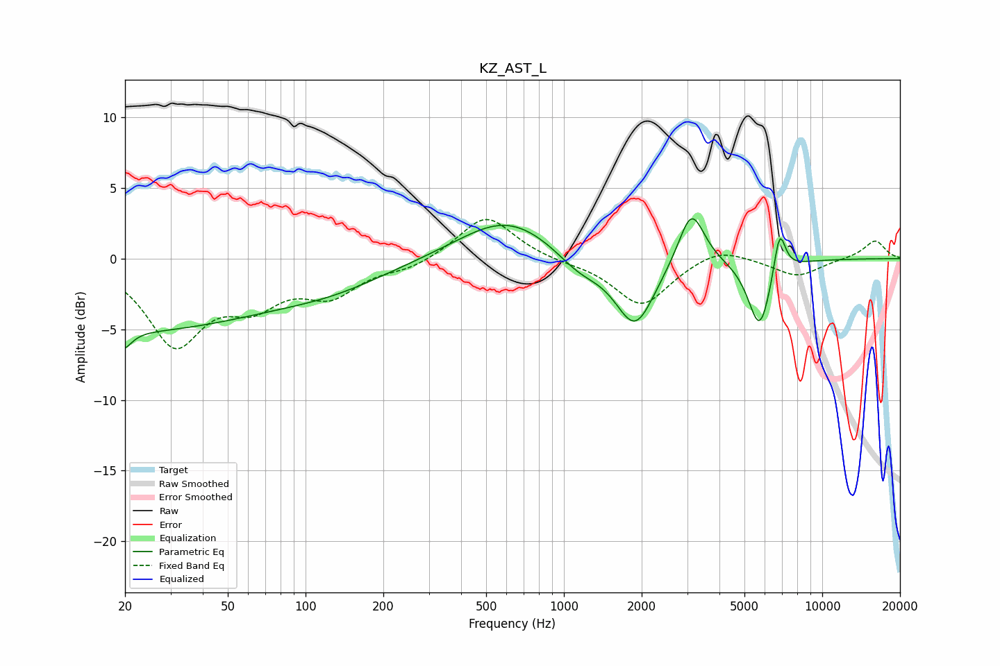

# KZ_AST_L
See [usage instructions](https://github.com/jaakkopasanen/AutoEq#usage) for more options and info.

### Parametric EQs
Apply preamp of -2.9 dB when using parametric equalizer.

|   # | Type    |   Fc (Hz) |    Q |   Gain (dB) |
|-----|---------|-----------|------|-------------|
|   1 | Peaking |        20 | 5.58 |        -4.4 |
|   2 | Peaking |        20 | 0.24 |        -5   |
|   3 | Peaking |        20 | 5.94 |         3.2 |
|   4 | Peaking |       129 | 0.64 |        -1.3 |
|   5 | Peaking |       602 | 0.77 |         3   |
|   6 | Peaking |      1148 | 1.55 |        -1.3 |
|   7 | Peaking |      1886 | 1.84 |        -4.9 |
|   8 | Peaking |      3117 | 2.81 |         4   |
|   9 | Peaking |      5726 | 3.09 |        -5   |
|  10 | Peaking |      6839 | 5.9  |         3.2 |

### Fixed Band EQs
When using fixed band (also called graphic) equalizer, apply preamp of **-2.9 dB** (if available) and set gains manually with these parameters.

|   # | Type    |   Fc (Hz) |    Q |   Gain (dB) |
|-----|---------|-----------|------|-------------|
|   1 | Peaking |        31 | 1.41 |        -5.8 |
|   2 | Peaking |        62 | 1.41 |        -2.6 |
|   3 | Peaking |       125 | 1.41 |        -2.3 |
|   4 | Peaking |       250 | 1.41 |        -0.6 |
|   5 | Peaking |       500 | 1.41 |         3.1 |
|   6 | Peaking |      1000 | 1.41 |        -0.2 |
|   7 | Peaking |      2000 | 1.41 |        -3.3 |
|   8 | Peaking |      4000 | 1.41 |         0.9 |
|   9 | Peaking |      8000 | 1.41 |        -1.3 |
|  10 | Peaking |     16000 | 1.41 |         1.3 |

### Graphs

