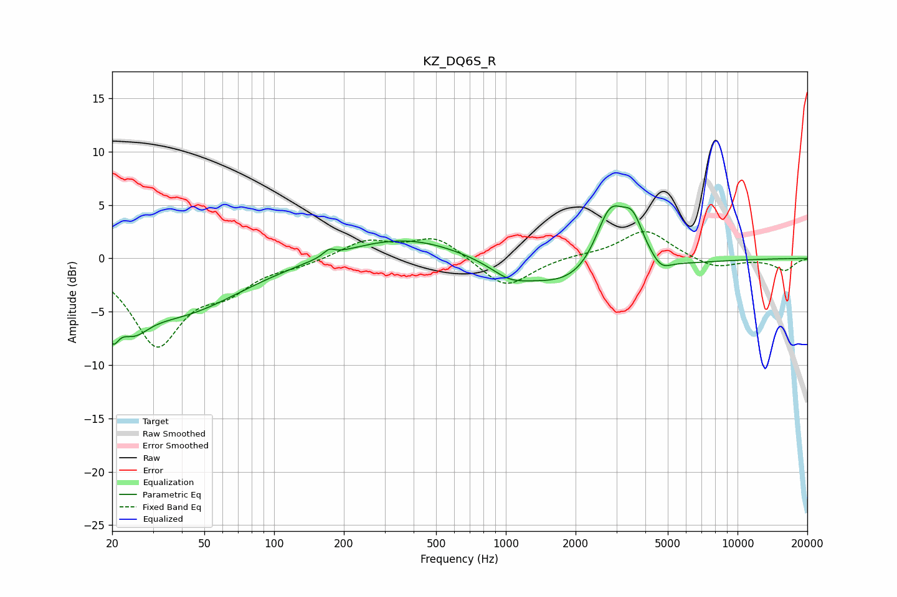

# KZ_DQ6S_R
See [usage instructions](https://github.com/jaakkopasanen/AutoEq#usage) for more options and info.

### Parametric EQs
Apply preamp of -5.0 dB when using parametric equalizer.

|   # | Type    |   Fc (Hz) |    Q |   Gain (dB) |
|-----|---------|-----------|------|-------------|
|   1 | Peaking |        20 | 5.26 |        -3.1 |
|   2 | Peaking |        25 | 2.08 |        -2.7 |
|   3 | Peaking |        38 | 0.53 |        -5   |
|   4 | Peaking |       173 | 5.88 |         0.6 |
|   5 | Peaking |       369 | 0.55 |         2.1 |
|   6 | Peaking |      1038 | 1.83 |        -1.1 |
|   7 | Peaking |      2105 | 0.57 |        -3.4 |
|   8 | Peaking |      2817 | 2.06 |         6.5 |
|   9 | Peaking |      3536 | 2.92 |         3.6 |
|  10 | Peaking |      4684 | 3.56 |        -0.9 |

### Fixed Band EQs
When using fixed band (also called graphic) equalizer, apply preamp of **-2.6 dB** (if available) and set gains manually with these parameters.

|   # | Type    |   Fc (Hz) |    Q |   Gain (dB) |
|-----|---------|-----------|------|-------------|
|   1 | Peaking |        31 | 1.41 |        -7.9 |
|   2 | Peaking |        62 | 1.41 |        -2.4 |
|   3 | Peaking |       125 | 1.41 |        -0.5 |
|   4 | Peaking |       250 | 1.41 |         1.6 |
|   5 | Peaking |       500 | 1.41 |         2   |
|   6 | Peaking |      1000 | 1.41 |        -2.9 |
|   7 | Peaking |      2000 | 1.41 |         0.2 |
|   8 | Peaking |      4000 | 1.41 |         2.7 |
|   9 | Peaking |      8000 | 1.41 |        -1   |
|  10 | Peaking |     16000 | 1.41 |        -1.1 |

### Graphs

