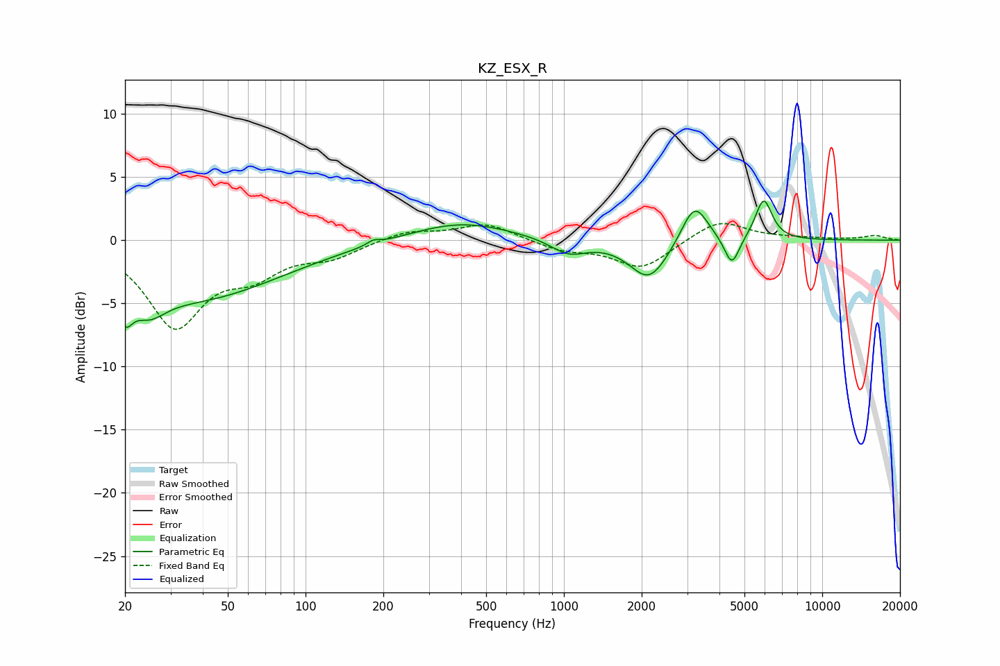

# KZ_ESX_R
See [usage instructions](https://github.com/jaakkopasanen/AutoEq#usage) for more options and info.

### Parametric EQs
Apply preamp of -3.2 dB when using parametric equalizer.

|   # | Type    |   Fc (Hz) |    Q |   Gain (dB) |
|-----|---------|-----------|------|-------------|
|   1 | Peaking |        20 | 5.01 |        -2.4 |
|   2 | Peaking |        25 | 2.2  |        -1.9 |
|   3 | Peaking |        37 | 0.43 |        -4.5 |
|   4 | Peaking |       183 | 5.94 |         0.3 |
|   5 | Peaking |       397 | 0.72 |         1.5 |
|   6 | Peaking |      1042 | 2.03 |        -1.2 |
|   7 | Peaking |      2138 | 1.88 |        -3.2 |
|   8 | Peaking |      3204 | 2.75 |         3.3 |
|   9 | Peaking |      4467 | 4.83 |        -2.4 |
|  10 | Peaking |      5932 | 4.24 |         3.3 |

### Fixed Band EQs
When using fixed band (also called graphic) equalizer, apply preamp of **-1.4 dB** (if available) and set gains manually with these parameters.

|   # | Type    |   Fc (Hz) |    Q |   Gain (dB) |
|-----|---------|-----------|------|-------------|
|   1 | Peaking |        31 | 1.41 |        -6.6 |
|   2 | Peaking |        62 | 1.41 |        -2.2 |
|   3 | Peaking |       125 | 1.41 |        -1.2 |
|   4 | Peaking |       250 | 1.41 |         0.8 |
|   5 | Peaking |       500 | 1.41 |         1.3 |
|   6 | Peaking |      1000 | 1.41 |        -0.8 |
|   7 | Peaking |      2000 | 1.41 |        -2.2 |
|   8 | Peaking |      4000 | 1.41 |         1.7 |
|   9 | Peaking |      8000 | 1.41 |         0.1 |
|  10 | Peaking |     16000 | 1.41 |         0.4 |

### Graphs

