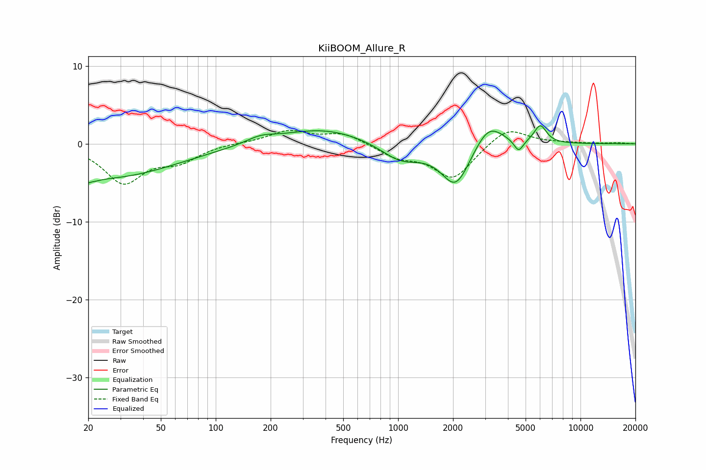

# KiiBOOM_Allure_R
See [usage instructions](https://github.com/jaakkopasanen/AutoEq#usage) for more options and info.

### Parametric EQs
Apply preamp of -2.4 dB when using parametric equalizer.

|   # | Type    |   Fc (Hz) |    Q |   Gain (dB) |
|-----|---------|-----------|------|-------------|
|   1 | Peaking |        20 | 5.29 |        -3.9 |
|   2 | Peaking |        20 | 5.86 |         3.3 |
|   3 | Peaking |        24 | 0.36 |        -4.4 |
|   4 | Peaking |       176 | 1.81 |         0.8 |
|   5 | Peaking |       388 | 0.61 |         2   |
|   6 | Peaking |      1037 | 1.27 |        -2.3 |
|   7 | Peaking |      2071 | 1.77 |        -5.5 |
|   8 | Peaking |      3135 | 1.8  |         3.2 |
|   9 | Peaking |      4579 | 5.57 |        -1.6 |
|  10 | Peaking |      6021 | 4.08 |         2.3 |

### Fixed Band EQs
When using fixed band (also called graphic) equalizer, apply preamp of **-1.8 dB** (if available) and set gains manually with these parameters.

|   # | Type    |   Fc (Hz) |    Q |   Gain (dB) |
|-----|---------|-----------|------|-------------|
|   1 | Peaking |        31 | 1.41 |        -4.8 |
|   2 | Peaking |        62 | 1.41 |        -2   |
|   3 | Peaking |       125 | 1.41 |         0.1 |
|   4 | Peaking |       250 | 1.41 |         1.6 |
|   5 | Peaking |       500 | 1.41 |         1.4 |
|   6 | Peaking |      1000 | 1.41 |        -1.5 |
|   7 | Peaking |      2000 | 1.41 |        -4.4 |
|   8 | Peaking |      4000 | 1.41 |         2.3 |
|   9 | Peaking |      8000 | 1.41 |         0.1 |
|  10 | Peaking |     16000 | 1.41 |         0.1 |

### Graphs

