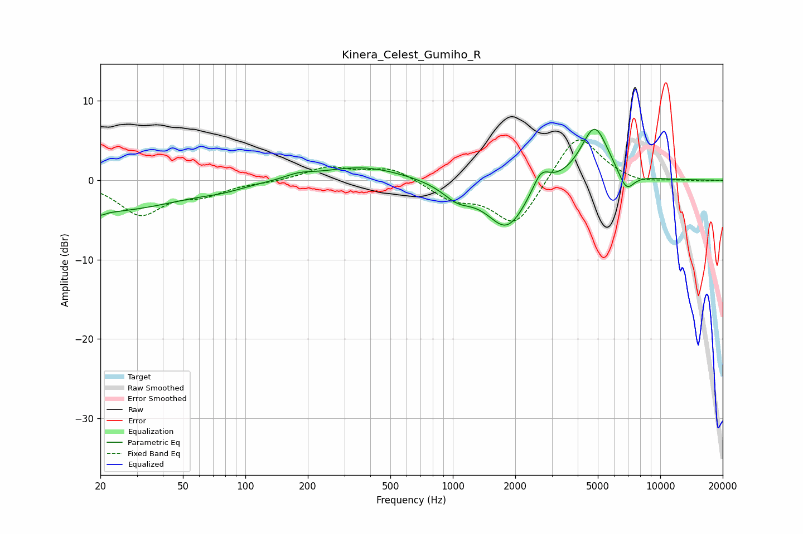

# Kinera_Celest_Gumiho_R
See [usage instructions](https://github.com/jaakkopasanen/AutoEq#usage) for more options and info.

### Parametric EQs
Apply preamp of -6.5 dB when using parametric equalizer.

|   # | Type    |   Fc (Hz) |    Q |   Gain (dB) |
|-----|---------|-----------|------|-------------|
|   1 | Peaking |        20 | 0.37 |        -4   |
|   2 | Peaking |        20 | 5.96 |        -0.5 |
|   3 | Peaking |        78 | 1.52 |        -0.4 |
|   4 | Peaking |       180 | 2.11 |         0.6 |
|   5 | Peaking |       366 | 0.72 |         1.8 |
|   6 | Peaking |      1053 | 1.95 |        -1.8 |
|   7 | Peaking |      1822 | 1.45 |        -6.1 |
|   8 | Peaking |      2664 | 3.34 |         2.6 |
|   9 | Peaking |      4827 | 2.05 |         7.1 |
|  10 | Peaking |      6855 | 3.56 |        -2.5 |

### Fixed Band EQs
When using fixed band (also called graphic) equalizer, apply preamp of **-5.2 dB** (if available) and set gains manually with these parameters.

|   # | Type    |   Fc (Hz) |    Q |   Gain (dB) |
|-----|---------|-----------|------|-------------|
|   1 | Peaking |        31 | 1.41 |        -4.2 |
|   2 | Peaking |        62 | 1.41 |        -1.5 |
|   3 | Peaking |       125 | 1.41 |        -0.2 |
|   4 | Peaking |       250 | 1.41 |         1.6 |
|   5 | Peaking |       500 | 1.41 |         1.6 |
|   6 | Peaking |      1000 | 1.41 |        -2.2 |
|   7 | Peaking |      2000 | 1.41 |        -5.9 |
|   8 | Peaking |      4000 | 1.41 |         6.2 |
|   9 | Peaking |      8000 | 1.41 |        -0.6 |
|  10 | Peaking |     16000 | 1.41 |        -0.1 |

### Graphs

