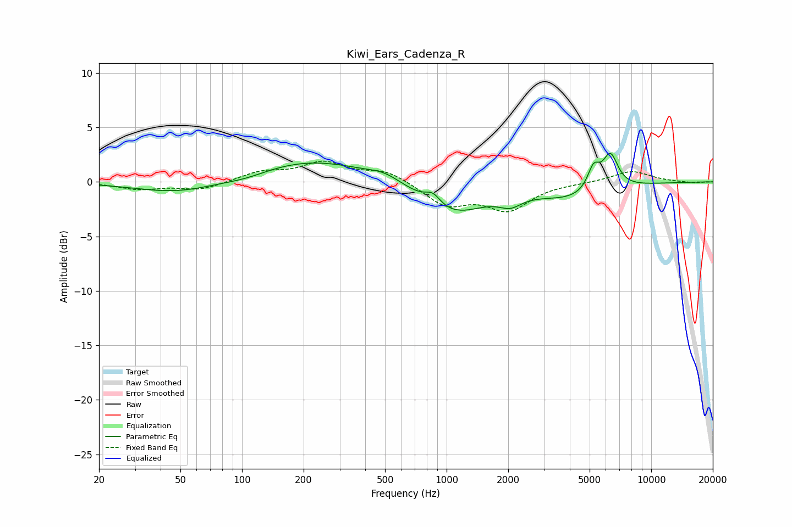

# Kiwi_Ears_Cadenza_R
See [usage instructions](https://github.com/jaakkopasanen/AutoEq#usage) for more options and info.

### Parametric EQs
Apply preamp of -2.7 dB when using parametric equalizer.

|   # | Type    |   Fc (Hz) |    Q |   Gain (dB) |
|-----|---------|-----------|------|-------------|
|   1 | Peaking |        49 | 0.69 |        -1.1 |
|   2 | Peaking |       105 | 1.34 |        -0.4 |
|   3 | Peaking |       219 | 0.5  |         2   |
|   4 | Peaking |       497 | 1.75 |         0.7 |
|   5 | Peaking |       856 | 3.69 |         1   |
|   6 | Peaking |      1054 | 0.87 |        -2.9 |
|   7 | Peaking |      2049 | 2.6  |        -0.9 |
|   8 | Peaking |      4145 | 0.8  |        -1.4 |
|   9 | Peaking |      5231 | 4.59 |         2.1 |
|  10 | Peaking |      6313 | 3.63 |         3.1 |

### Fixed Band EQs
When using fixed band (also called graphic) equalizer, apply preamp of **-2.0 dB** (if available) and set gains manually with these parameters.

|   # | Type    |   Fc (Hz) |    Q |   Gain (dB) |
|-----|---------|-----------|------|-------------|
|   1 | Peaking |        31 | 1.41 |        -0.6 |
|   2 | Peaking |        62 | 1.41 |        -0.7 |
|   3 | Peaking |       125 | 1.41 |         0.9 |
|   4 | Peaking |       250 | 1.41 |         1.7 |
|   5 | Peaking |       500 | 1.41 |         1   |
|   6 | Peaking |      1000 | 1.41 |        -2.1 |
|   7 | Peaking |      2000 | 1.41 |        -2.4 |
|   8 | Peaking |      4000 | 1.41 |        -0.1 |
|   9 | Peaking |      8000 | 1.41 |         1   |
|  10 | Peaking |     16000 | 1.41 |        -0.1 |

### Graphs

