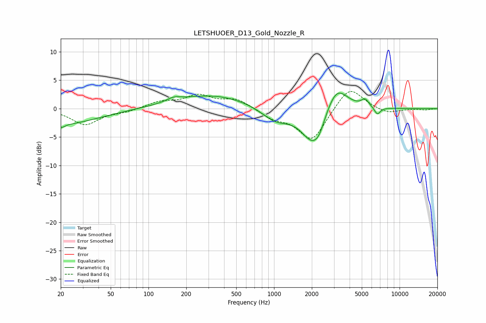

# LETSHUOER_D13_Gold_Nozzle_R
See [usage instructions](https://github.com/jaakkopasanen/AutoEq#usage) for more options and info.

### Parametric EQs
Apply preamp of -2.8 dB when using parametric equalizer.

|   # | Type    |   Fc (Hz) |    Q |   Gain (dB) |
|-----|---------|-----------|------|-------------|
|   1 | Peaking |        20 | 0.48 |        -2.7 |
|   2 | Peaking |        20 | 4.91 |        -0.6 |
|   3 | Peaking |       159 | 2.53 |         0.7 |
|   4 | Peaking |       324 | 0.47 |         2.4 |
|   5 | Peaking |      1024 | 1.26 |        -2.3 |
|   6 | Peaking |      2040 | 1.54 |        -6.2 |
|   7 | Peaking |      2284 | 3.63 |        -1.2 |
|   8 | Peaking |      3140 | 1.63 |         4.8 |
|   9 | Peaking |      5314 | 4.65 |         1.3 |
|  10 | Peaking |      6649 | 5.65 |        -1.3 |

### Fixed Band EQs
When using fixed band (also called graphic) equalizer, apply preamp of **-3.1 dB** (if available) and set gains manually with these parameters.

|   # | Type    |   Fc (Hz) |    Q |   Gain (dB) |
|-----|---------|-----------|------|-------------|
|   1 | Peaking |        31 | 1.41 |        -2.8 |
|   2 | Peaking |        62 | 1.41 |        -0.5 |
|   3 | Peaking |       125 | 1.41 |         1.1 |
|   4 | Peaking |       250 | 1.41 |         2.2 |
|   5 | Peaking |       500 | 1.41 |         1.7 |
|   6 | Peaking |      1000 | 1.41 |        -1.5 |
|   7 | Peaking |      2000 | 1.41 |        -5.7 |
|   8 | Peaking |      4000 | 1.41 |         4.2 |
|   9 | Peaking |      8000 | 1.41 |        -0.9 |
|  10 | Peaking |     16000 | 1.41 |        -0.2 |

### Graphs

