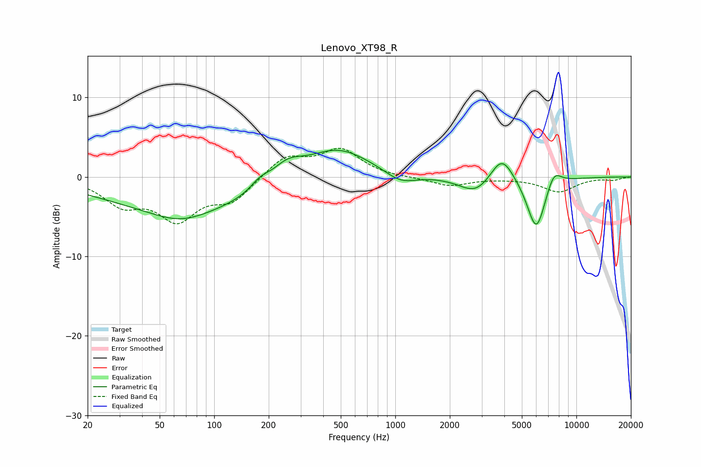

# Lenovo_XT98_R
See [usage instructions](https://github.com/jaakkopasanen/AutoEq#usage) for more options and info.

### Parametric EQs
Apply preamp of -3.4 dB when using parametric equalizer.

|   # | Type    |   Fc (Hz) |    Q |   Gain (dB) |
|-----|---------|-----------|------|-------------|
|   1 | Peaking |        65 | 0.94 |        -1.6 |
|   2 | Peaking |        73 | 0.28 |        -4   |
|   3 | Peaking |       179 | 2.59 |         1.2 |
|   4 | Peaking |       253 | 1.59 |         2.3 |
|   5 | Peaking |       473 | 0.77 |         4   |
|   6 | Peaking |      1072 | 1.64 |        -1.4 |
|   7 | Peaking |      2800 | 1.56 |        -2.3 |
|   8 | Peaking |      3871 | 2.17 |         3.6 |
|   9 | Peaking |      6009 | 2.62 |        -6.9 |
|  10 | Peaking |      7493 | 3.26 |         2.2 |

### Fixed Band EQs
When using fixed band (also called graphic) equalizer, apply preamp of **-3.7 dB** (if available) and set gains manually with these parameters.

|   # | Type    |   Fc (Hz) |    Q |   Gain (dB) |
|-----|---------|-----------|------|-------------|
|   1 | Peaking |        31 | 1.41 |        -3.1 |
|   2 | Peaking |        62 | 1.41 |        -4.9 |
|   3 | Peaking |       125 | 1.41 |        -2.8 |
|   4 | Peaking |       250 | 1.41 |         2.6 |
|   5 | Peaking |       500 | 1.41 |         3.3 |
|   6 | Peaking |      1000 | 1.41 |        -0.1 |
|   7 | Peaking |      2000 | 1.41 |        -1.1 |
|   8 | Peaking |      4000 | 1.41 |        -0.1 |
|   9 | Peaking |      8000 | 1.41 |        -1.8 |
|  10 | Peaking |     16000 | 1.41 |        -0.4 |

### Graphs

