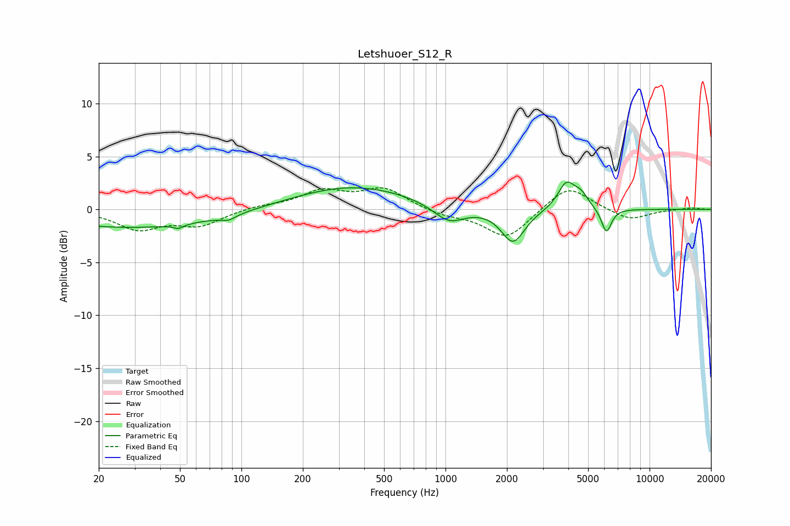

# Letshuoer_S12_R
See [usage instructions](https://github.com/jaakkopasanen/AutoEq#usage) for more options and info.

### Parametric EQs
Apply preamp of -2.7 dB when using parametric equalizer.

|   # | Type    |   Fc (Hz) |    Q |   Gain (dB) |
|-----|---------|-----------|------|-------------|
|   1 | Peaking |        30 | 0.33 |        -1.7 |
|   2 | Peaking |        48 | 6    |         1.4 |
|   3 | Peaking |        49 | 5.91 |        -1.7 |
|   4 | Peaking |        86 | 3.68 |        -0.5 |
|   5 | Peaking |       349 | 0.48 |         2.2 |
|   6 | Peaking |      1040 | 1.82 |        -1.7 |
|   7 | Peaking |      2144 | 2.46 |        -3.2 |
|   8 | Peaking |      3918 | 3.29 |         2.5 |
|   9 | Peaking |      4622 | 4.07 |         1.1 |
|  10 | Peaking |      6146 | 5.65 |        -2.3 |

### Fixed Band EQs
When using fixed band (also called graphic) equalizer, apply preamp of **-2.1 dB** (if available) and set gains manually with these parameters.

|   # | Type    |   Fc (Hz) |    Q |   Gain (dB) |
|-----|---------|-----------|------|-------------|
|   1 | Peaking |        31 | 1.41 |        -1.8 |
|   2 | Peaking |        62 | 1.41 |        -1.4 |
|   3 | Peaking |       125 | 1.41 |         0.3 |
|   4 | Peaking |       250 | 1.41 |         1.6 |
|   5 | Peaking |       500 | 1.41 |         1.9 |
|   6 | Peaking |      1000 | 1.41 |        -0.5 |
|   7 | Peaking |      2000 | 1.41 |        -2.8 |
|   8 | Peaking |      4000 | 1.41 |         2.4 |
|   9 | Peaking |      8000 | 1.41 |        -1.1 |
|  10 | Peaking |     16000 | 1.41 |         0.2 |

### Graphs

