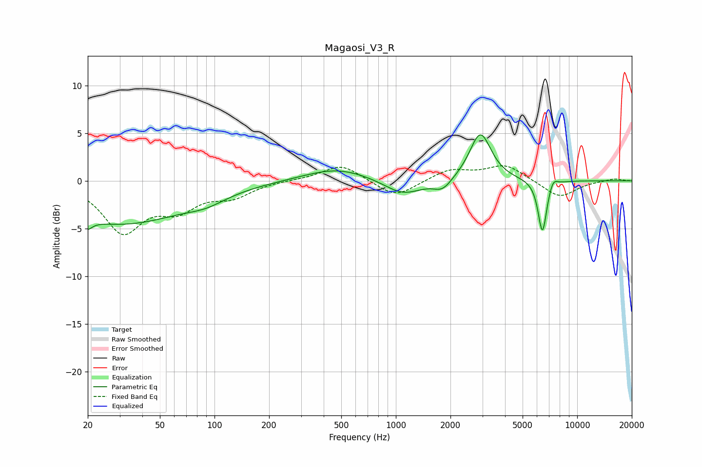

# Magaosi_V3_R
See [usage instructions](https://github.com/jaakkopasanen/AutoEq#usage) for more options and info.

### Parametric EQs
Apply preamp of -4.9 dB when using parametric equalizer.

|   # | Type    |   Fc (Hz) |    Q |   Gain (dB) |
|-----|---------|-----------|------|-------------|
|   1 | Peaking |        20 | 5.74 |        -4.1 |
|   2 | Peaking |        20 | 6    |         3   |
|   3 | Peaking |        30 | 0.39 |        -4.5 |
|   4 | Peaking |        90 | 1.32 |        -0.8 |
|   5 | Peaking |       473 | 0.79 |         1.4 |
|   6 | Peaking |      1095 | 1.35 |        -1.6 |
|   7 | Peaking |      1811 | 2.84 |        -1.1 |
|   8 | Peaking |      2923 | 2.39 |         5.1 |
|   9 | Peaking |      6429 | 5.73 |        -5.6 |
|  10 | Peaking |      7371 | 6    |         0.9 |

### Fixed Band EQs
When using fixed band (also called graphic) equalizer, apply preamp of **-1.7 dB** (if available) and set gains manually with these parameters.

|   # | Type    |   Fc (Hz) |    Q |   Gain (dB) |
|-----|---------|-----------|------|-------------|
|   1 | Peaking |        31 | 1.41 |        -5.1 |
|   2 | Peaking |        62 | 1.41 |        -2.5 |
|   3 | Peaking |       125 | 1.41 |        -1.5 |
|   4 | Peaking |       250 | 1.41 |         0.1 |
|   5 | Peaking |       500 | 1.41 |         1.8 |
|   6 | Peaking |      1000 | 1.41 |        -1.8 |
|   7 | Peaking |      2000 | 1.41 |         1.2 |
|   8 | Peaking |      4000 | 1.41 |         1.6 |
|   9 | Peaking |      8000 | 1.41 |        -1.8 |
|  10 | Peaking |     16000 | 1.41 |         0.3 |

### Graphs

