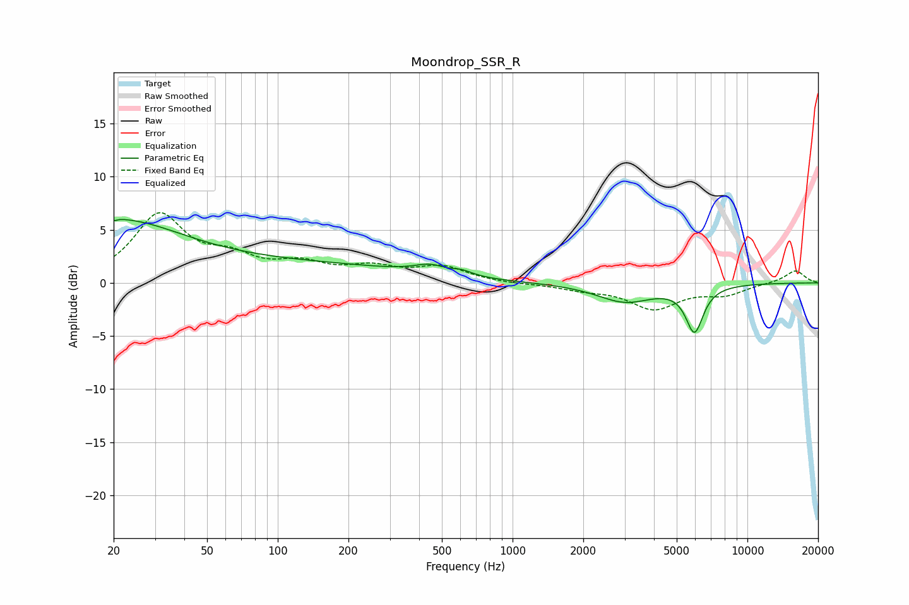

# Moondrop_SSR_R
See [usage instructions](https://github.com/jaakkopasanen/AutoEq#usage) for more options and info.

### Parametric EQs
Apply preamp of -6.1 dB when using parametric equalizer.

|   # | Type    |   Fc (Hz) |    Q |   Gain (dB) |
|-----|---------|-----------|------|-------------|
|   1 | Peaking |        20 | 0.54 |         4.8 |
|   2 | Peaking |        20 | 5.95 |        -3.3 |
|   3 | Peaking |        20 | 5.79 |         3.3 |
|   4 | Peaking |        87 | 0.22 |         1.8 |
|   5 | Peaking |       451 | 1.97 |         0.9 |
|   6 | Peaking |       567 | 2.61 |        -0.9 |
|   7 | Peaking |       587 | 2.74 |         1.2 |
|   8 | Peaking |      3012 | 1.17 |        -1.7 |
|   9 | Peaking |      5849 | 4    |         0.7 |
|  10 | Peaking |      5937 | 3.75 |        -4.9 |

### Fixed Band EQs
When using fixed band (also called graphic) equalizer, apply preamp of **-6.7 dB** (if available) and set gains manually with these parameters.

|   # | Type    |   Fc (Hz) |    Q |   Gain (dB) |
|-----|---------|-----------|------|-------------|
|   1 | Peaking |        31 | 1.41 |         6.2 |
|   2 | Peaking |        62 | 1.41 |         1.9 |
|   3 | Peaking |       125 | 1.41 |         1.5 |
|   4 | Peaking |       250 | 1.41 |         1.2 |
|   5 | Peaking |       500 | 1.41 |         1.4 |
|   6 | Peaking |      1000 | 1.41 |        -0.1 |
|   7 | Peaking |      2000 | 1.41 |        -0.5 |
|   8 | Peaking |      4000 | 1.41 |        -2.3 |
|   9 | Peaking |      8000 | 1.41 |        -1   |
|  10 | Peaking |     16000 | 1.41 |         1.2 |

### Graphs

