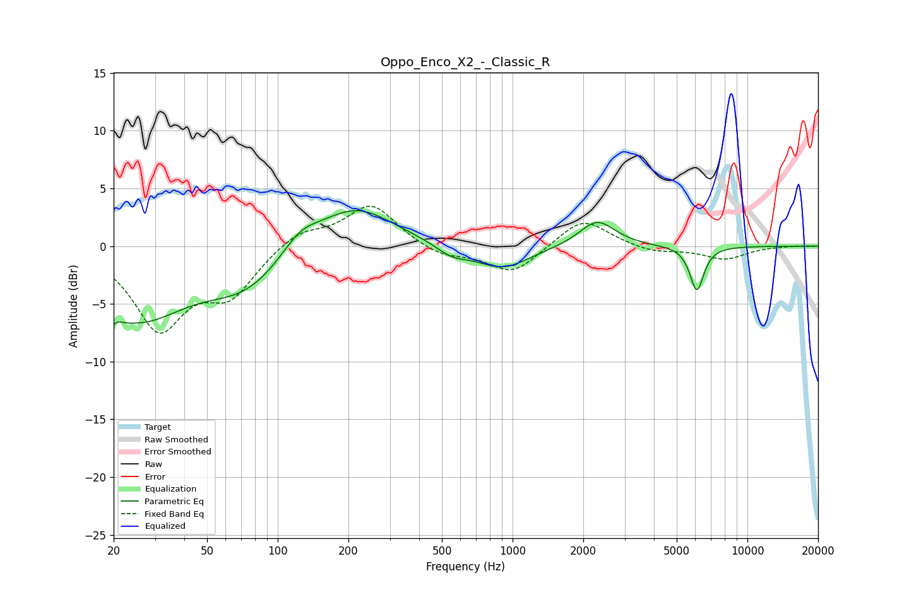

# Oppo_Enco_X2_-_Classic_R
See [usage instructions](https://github.com/jaakkopasanen/AutoEq#usage) for more options and info.

### Parametric EQs
Apply preamp of -3.2 dB when using parametric equalizer.

|   # | Type    |   Fc (Hz) |    Q |   Gain (dB) |
|-----|---------|-----------|------|-------------|
|   1 | Peaking |        20 | 4.37 |        -4.9 |
|   2 | Peaking |        20 | 5.15 |         3.6 |
|   3 | Peaking |        26 | 0.71 |        -5.8 |
|   4 | Peaking |        74 | 0.8  |        -3.3 |
|   5 | Peaking |       124 | 1.7  |         1.8 |
|   6 | Peaking |       213 | 0.85 |         3.6 |
|   7 | Peaking |       550 | 2.16 |        -0.9 |
|   8 | Peaking |       902 | 1.22 |        -2   |
|   9 | Peaking |      2291 | 1.85 |         2.3 |
|  10 | Peaking |      6092 | 4.62 |        -3.9 |

### Fixed Band EQs
When using fixed band (also called graphic) equalizer, apply preamp of **-3.6 dB** (if available) and set gains manually with these parameters.

|   # | Type    |   Fc (Hz) |    Q |   Gain (dB) |
|-----|---------|-----------|------|-------------|
|   1 | Peaking |        31 | 1.41 |        -6.9 |
|   2 | Peaking |        62 | 1.41 |        -3.8 |
|   3 | Peaking |       125 | 1.41 |         1.4 |
|   4 | Peaking |       250 | 1.41 |         3.6 |
|   5 | Peaking |       500 | 1.41 |        -0.9 |
|   6 | Peaking |      1000 | 1.41 |        -2.4 |
|   7 | Peaking |      2000 | 1.41 |         2.5 |
|   8 | Peaking |      4000 | 1.41 |        -0.6 |
|   9 | Peaking |      8000 | 1.41 |        -1.1 |
|  10 | Peaking |     16000 | 1.41 |         0.1 |

### Graphs

