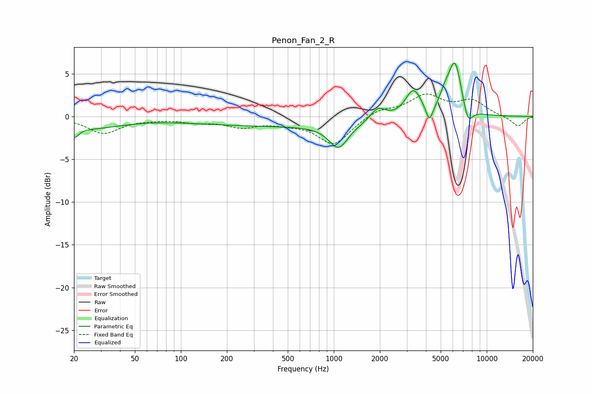

# Penon_Fan_2_R
See [usage instructions](https://github.com/jaakkopasanen/AutoEq#usage) for more options and info.

### Parametric EQs
Apply preamp of -6.4 dB when using parametric equalizer.

|   # | Type    |   Fc (Hz) |    Q |   Gain (dB) |
|-----|---------|-----------|------|-------------|
|   1 | Peaking |        20 | 4.79 |        -1.3 |
|   2 | Peaking |        25 | 0.66 |        -1.3 |
|   3 | Peaking |       488 | 0.2  |        -1.1 |
|   4 | Peaking |      1073 | 2.28 |        -2.8 |
|   5 | Peaking |      1940 | 2.78 |         1.6 |
|   6 | Peaking |      3312 | 2.68 |         3.2 |
|   7 | Peaking |      4215 | 6    |        -2   |
|   8 | Peaking |      5322 | 4.21 |         1.3 |
|   9 | Peaking |      6195 | 3.07 |         6.3 |
|  10 | Peaking |      7525 | 4.26 |        -2.2 |

### Fixed Band EQs
When using fixed band (also called graphic) equalizer, apply preamp of **-2.7 dB** (if available) and set gains manually with these parameters.

|   # | Type    |   Fc (Hz) |    Q |   Gain (dB) |
|-----|---------|-----------|------|-------------|
|   1 | Peaking |        31 | 1.41 |        -1.9 |
|   2 | Peaking |        62 | 1.41 |        -0.2 |
|   3 | Peaking |       125 | 1.41 |        -0.5 |
|   4 | Peaking |       250 | 1.41 |        -1.1 |
|   5 | Peaking |       500 | 1.41 |        -0.6 |
|   6 | Peaking |      1000 | 1.41 |        -3.3 |
|   7 | Peaking |      2000 | 1.41 |         0.9 |
|   8 | Peaking |      4000 | 1.41 |         2.4 |
|   9 | Peaking |      8000 | 1.41 |         1.7 |
|  10 | Peaking |     16000 | 1.41 |        -1.2 |

### Graphs

