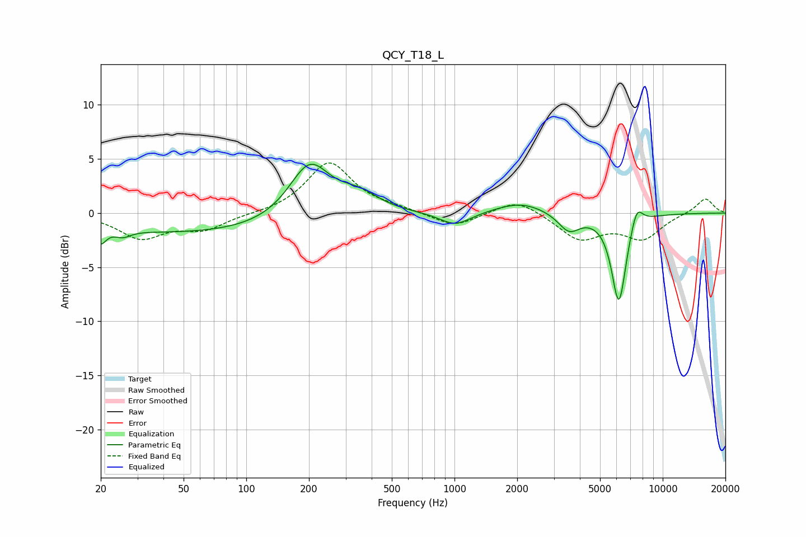

# QCY_T18_L
See [usage instructions](https://github.com/jaakkopasanen/AutoEq#usage) for more options and info.

### Parametric EQs
Apply preamp of -4.6 dB when using parametric equalizer.

|   # | Type    |   Fc (Hz) |    Q |   Gain (dB) |
|-----|---------|-----------|------|-------------|
|   1 | Peaking |        20 | 5.6  |        -1.4 |
|   2 | Peaking |        26 | 3.85 |        -0.6 |
|   3 | Peaking |        58 | 0.24 |        -1.9 |
|   4 | Peaking |       201 | 1.42 |         5.2 |
|   5 | Peaking |       346 | 1.43 |         1.6 |
|   6 | Peaking |      1008 | 1.86 |        -1.3 |
|   7 | Peaking |      2086 | 1.17 |         1.1 |
|   8 | Peaking |      3547 | 2.71 |        -1.7 |
|   9 | Peaking |      6158 | 3.84 |        -8.3 |
|  10 | Peaking |      7497 | 4.67 |         2   |

### Fixed Band EQs
When using fixed band (also called graphic) equalizer, apply preamp of **-4.7 dB** (if available) and set gains manually with these parameters.

|   # | Type    |   Fc (Hz) |    Q |   Gain (dB) |
|-----|---------|-----------|------|-------------|
|   1 | Peaking |        31 | 1.41 |        -2.2 |
|   2 | Peaking |        62 | 1.41 |        -1.4 |
|   3 | Peaking |       125 | 1.41 |        -0.1 |
|   4 | Peaking |       250 | 1.41 |         4.7 |
|   5 | Peaking |       500 | 1.41 |         0.3 |
|   6 | Peaking |      1000 | 1.41 |        -1.3 |
|   7 | Peaking |      2000 | 1.41 |         1.4 |
|   8 | Peaking |      4000 | 1.41 |        -2.4 |
|   9 | Peaking |      8000 | 1.41 |        -2.3 |
|  10 | Peaking |     16000 | 1.41 |         1.4 |

### Graphs

