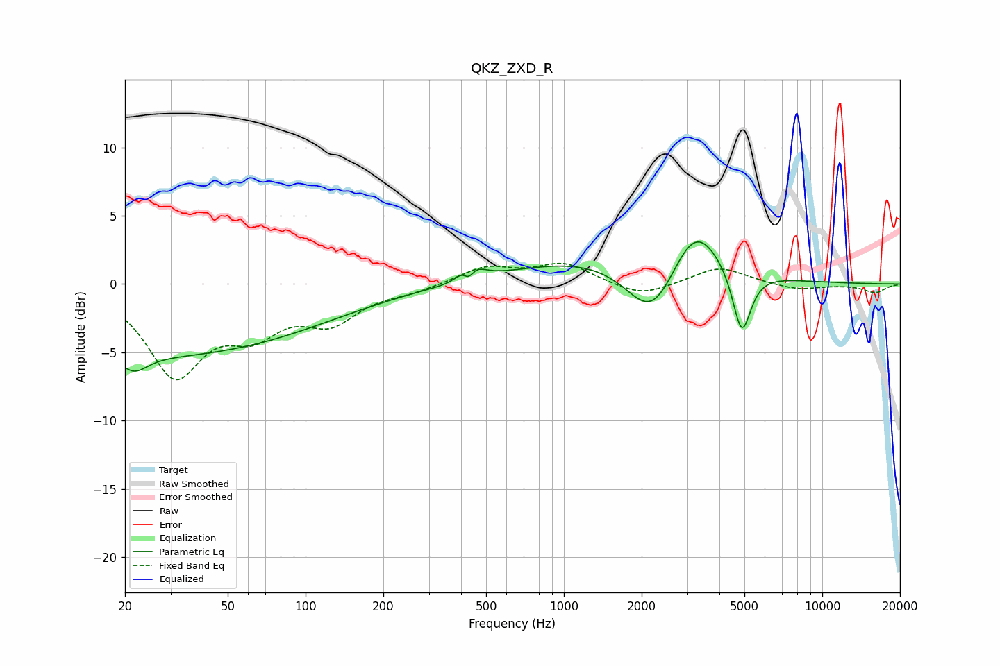

# QKZ_ZXD_R
See [usage instructions](https://github.com/jaakkopasanen/AutoEq#usage) for more options and info.

### Parametric EQs
Apply preamp of -3.2 dB when using parametric equalizer.

|   # | Type    |   Fc (Hz) |    Q |   Gain (dB) |
|-----|---------|-----------|------|-------------|
|   1 | Peaking |        22 | 2.84 |        -1.2 |
|   2 | Peaking |        26 | 0.2  |        -5.2 |
|   3 | Peaking |       410 | 2.5  |        -1.2 |
|   4 | Peaking |       418 | 5.36 |         1.9 |
|   5 | Peaking |       424 | 5.38 |        -3.6 |
|   6 | Peaking |       428 | 3.26 |         3.3 |
|   7 | Peaking |      1481 | 0.41 |         2.1 |
|   8 | Peaking |      2204 | 1.38 |        -4.8 |
|   9 | Peaking |      3208 | 1.46 |         4.2 |
|  10 | Peaking |      4883 | 3.93 |        -4.8 |

### Fixed Band EQs
When using fixed band (also called graphic) equalizer, apply preamp of **-1.6 dB** (if available) and set gains manually with these parameters.

|   # | Type    |   Fc (Hz) |    Q |   Gain (dB) |
|-----|---------|-----------|------|-------------|
|   1 | Peaking |        31 | 1.41 |        -6.4 |
|   2 | Peaking |        62 | 1.41 |        -2.9 |
|   3 | Peaking |       125 | 1.41 |        -2.5 |
|   4 | Peaking |       250 | 1.41 |        -0.4 |
|   5 | Peaking |       500 | 1.41 |         1.2 |
|   6 | Peaking |      1000 | 1.41 |         1.5 |
|   7 | Peaking |      2000 | 1.41 |        -1   |
|   8 | Peaking |      4000 | 1.41 |         1.3 |
|   9 | Peaking |      8000 | 1.41 |        -0.4 |
|  10 | Peaking |     16000 | 1.41 |        -0.6 |

### Graphs

