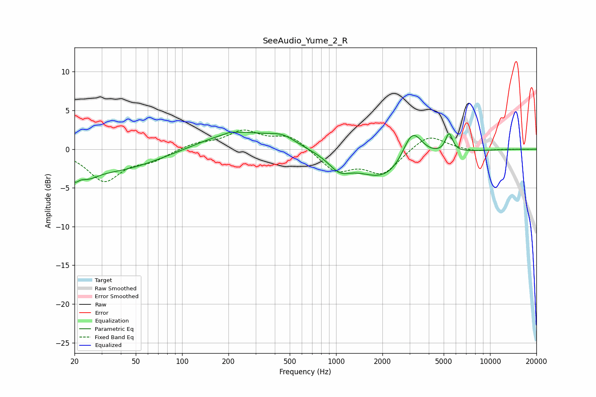

# SeeAudio_Yume_2_R
See [usage instructions](https://github.com/jaakkopasanen/AutoEq#usage) for more options and info.

### Parametric EQs
Apply preamp of -2.3 dB when using parametric equalizer.

|   # | Type    |   Fc (Hz) |    Q |   Gain (dB) |
|-----|---------|-----------|------|-------------|
|   1 | Peaking |        20 | 5.63 |        -1.4 |
|   2 | Peaking |        24 | 1.99 |        -1.5 |
|   3 | Peaking |        37 | 0.5  |        -2.7 |
|   4 | Peaking |       205 | 5.93 |         0.2 |
|   5 | Peaking |       227 | 0.61 |         2.3 |
|   6 | Peaking |       451 | 1.69 |         1.1 |
|   7 | Peaking |      1053 | 1.98 |        -1.8 |
|   8 | Peaking |      2130 | 0.77 |        -4.1 |
|   9 | Peaking |      3121 | 2.11 |         4.7 |
|  10 | Peaking |      5419 | 6    |         2.4 |

### Fixed Band EQs
When using fixed band (also called graphic) equalizer, apply preamp of **-2.6 dB** (if available) and set gains manually with these parameters.

|   # | Type    |   Fc (Hz) |    Q |   Gain (dB) |
|-----|---------|-----------|------|-------------|
|   1 | Peaking |        31 | 1.41 |        -4   |
|   2 | Peaking |        62 | 1.41 |        -1.2 |
|   3 | Peaking |       125 | 1.41 |         0.7 |
|   4 | Peaking |       250 | 1.41 |         2.2 |
|   5 | Peaking |       500 | 1.41 |         1.7 |
|   6 | Peaking |      1000 | 1.41 |        -2.8 |
|   7 | Peaking |      2000 | 1.41 |        -3.1 |
|   8 | Peaking |      4000 | 1.41 |         2.1 |
|   9 | Peaking |      8000 | 1.41 |        -0.3 |
|  10 | Peaking |     16000 | 1.41 |        -0   |

### Graphs

