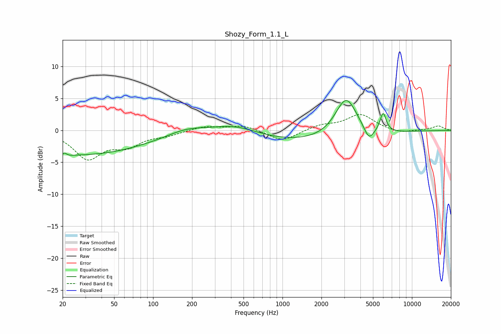

# Shozy_Form_1.1_L
See [usage instructions](https://github.com/jaakkopasanen/AutoEq#usage) for more options and info.

### Parametric EQs
Apply preamp of -4.8 dB when using parametric equalizer.

|   # | Type    |   Fc (Hz) |    Q |   Gain (dB) |
|-----|---------|-----------|------|-------------|
|   1 | Peaking |        20 | 5.19 |        -2.9 |
|   2 | Peaking |        21 | 6    |         3.1 |
|   3 | Peaking |        26 | 0.24 |        -3.8 |
|   4 | Peaking |        80 | 1.57 |         0   |
|   5 | Peaking |       178 | 0.97 |         1   |
|   6 | Peaking |       435 | 0.77 |         1.6 |
|   7 | Peaking |      1529 | 0.28 |        -2   |
|   8 | Peaking |      3103 | 1.65 |         6.4 |
|   9 | Peaking |      4655 | 3.75 |        -2.1 |
|  10 | Peaking |      5987 | 5.9  |         3   |

### Fixed Band EQs
When using fixed band (also called graphic) equalizer, apply preamp of **-2.6 dB** (if available) and set gains manually with these parameters.

|   # | Type    |   Fc (Hz) |    Q |   Gain (dB) |
|-----|---------|-----------|------|-------------|
|   1 | Peaking |        31 | 1.41 |        -4.2 |
|   2 | Peaking |        62 | 1.41 |        -2.1 |
|   3 | Peaking |       125 | 1.41 |        -0.7 |
|   4 | Peaking |       250 | 1.41 |         0.7 |
|   5 | Peaking |       500 | 1.41 |         0.8 |
|   6 | Peaking |      1000 | 1.41 |        -1.8 |
|   7 | Peaking |      2000 | 1.41 |         0.8 |
|   8 | Peaking |      4000 | 1.41 |         2.5 |
|   9 | Peaking |      8000 | 1.41 |        -0.5 |
|  10 | Peaking |     16000 | 1.41 |         0.7 |

### Graphs

