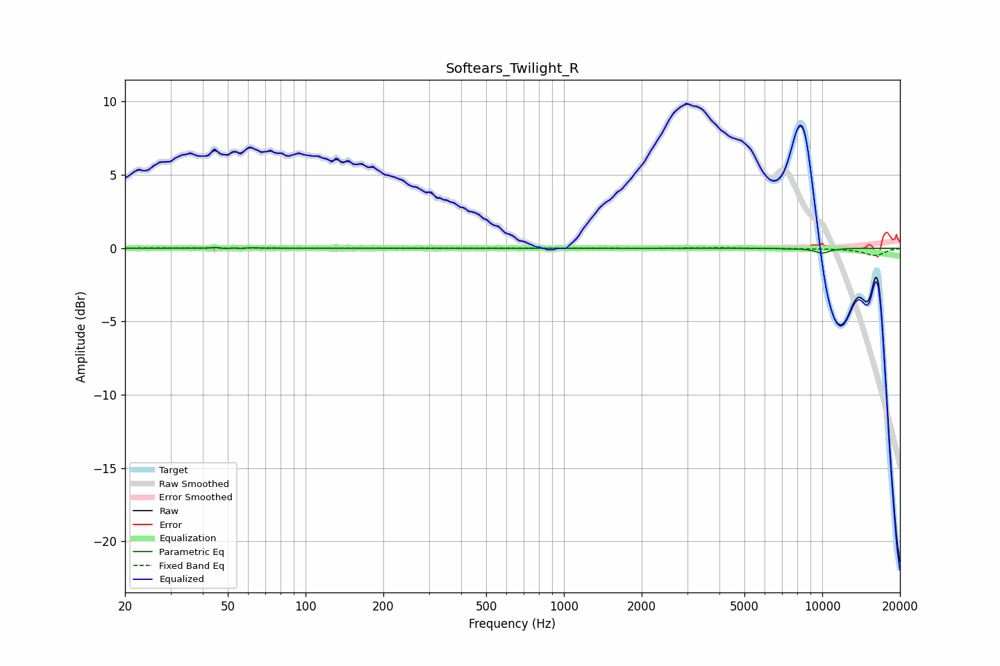

# Softears_Twilight_R
See [usage instructions](https://github.com/jaakkopasanen/AutoEq#usage) for more options and info.

### Parametric EQs
Apply preamp of -0.2 dB when using parametric equalizer.

|   # | Type    |   Fc (Hz) |    Q |   Gain (dB) |
|-----|---------|-----------|------|-------------|
|   1 | Peaking |        43 | 5.99 |        -0.1 |
|   2 | Peaking |        45 | 6    |         0.1 |
|   3 | Peaking |        45 | 6    |         0.1 |
|   4 | Peaking |        48 | 5.99 |        -0.1 |
|   5 | Peaking |        53 | 6    |         0.1 |
|   6 | Peaking |        57 | 6    |        -0.1 |
|   7 | Peaking |        60 | 6    |         0.1 |
|   8 | Peaking |      6870 | 6    |        -0   |
|   9 | Peaking |      7420 | 6    |        -0   |
|  10 | Peaking |     10000 | 3.88 |        -0.3 |

### Fixed Band EQs
When using fixed band (also called graphic) equalizer, apply preamp of **-0.1 dB** (if available) and set gains manually with these parameters.

|   # | Type    |   Fc (Hz) |    Q |   Gain (dB) |
|-----|---------|-----------|------|-------------|
|   1 | Peaking |        31 | 1.41 |         0   |
|   2 | Peaking |        62 | 1.41 |         0   |
|   3 | Peaking |       125 | 1.41 |         0   |
|   4 | Peaking |       250 | 1.41 |         0   |
|   5 | Peaking |       500 | 1.41 |         0   |
|   6 | Peaking |      1000 | 1.41 |        -0   |
|   7 | Peaking |      2000 | 1.41 |        -0   |
|   8 | Peaking |      4000 | 1.41 |         0   |
|   9 | Peaking |      8000 | 1.41 |        -0   |
|  10 | Peaking |     16000 | 1.41 |        -0.5 |

### Graphs

