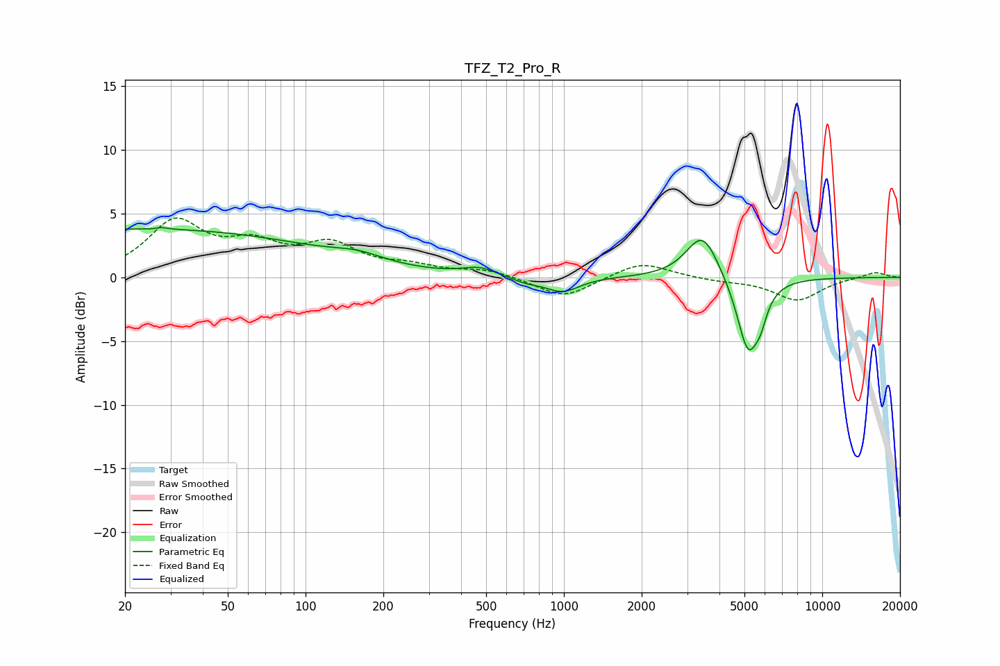

# TFZ_T2_Pro_R
See [usage instructions](https://github.com/jaakkopasanen/AutoEq#usage) for more options and info.

### Parametric EQs
Apply preamp of -4.0 dB when using parametric equalizer.

|   # | Type    |   Fc (Hz) |    Q |   Gain (dB) |
|-----|---------|-----------|------|-------------|
|   1 | Peaking |        23 | 0.18 |         3.8 |
|   2 | Peaking |        27 | 5.99 |        -3.1 |
|   3 | Peaking |        27 | 5.98 |         3.2 |
|   4 | Peaking |       160 | 1.43 |         0.6 |
|   5 | Peaking |       471 | 2.25 |         0.6 |
|   6 | Peaking |       713 | 2.41 |        -0.4 |
|   7 | Peaking |       988 | 2.17 |        -1.2 |
|   8 | Peaking |      3440 | 2.24 |         3.6 |
|   9 | Peaking |      5168 | 3.14 |        -5.9 |
|  10 | Peaking |      5777 | 5.87 |        -1.3 |

### Fixed Band EQs
When using fixed band (also called graphic) equalizer, apply preamp of **-4.8 dB** (if available) and set gains manually with these parameters.

|   # | Type    |   Fc (Hz) |    Q |   Gain (dB) |
|-----|---------|-----------|------|-------------|
|   1 | Peaking |        31 | 1.41 |         4.2 |
|   2 | Peaking |        62 | 1.41 |         2.1 |
|   3 | Peaking |       125 | 1.41 |         2.3 |
|   4 | Peaking |       250 | 1.41 |         0.7 |
|   5 | Peaking |       500 | 1.41 |         0.6 |
|   6 | Peaking |      1000 | 1.41 |        -1.6 |
|   7 | Peaking |      2000 | 1.41 |         1.3 |
|   8 | Peaking |      4000 | 1.41 |        -0.2 |
|   9 | Peaking |      8000 | 1.41 |        -1.8 |
|  10 | Peaking |     16000 | 1.41 |         0.5 |

### Graphs

