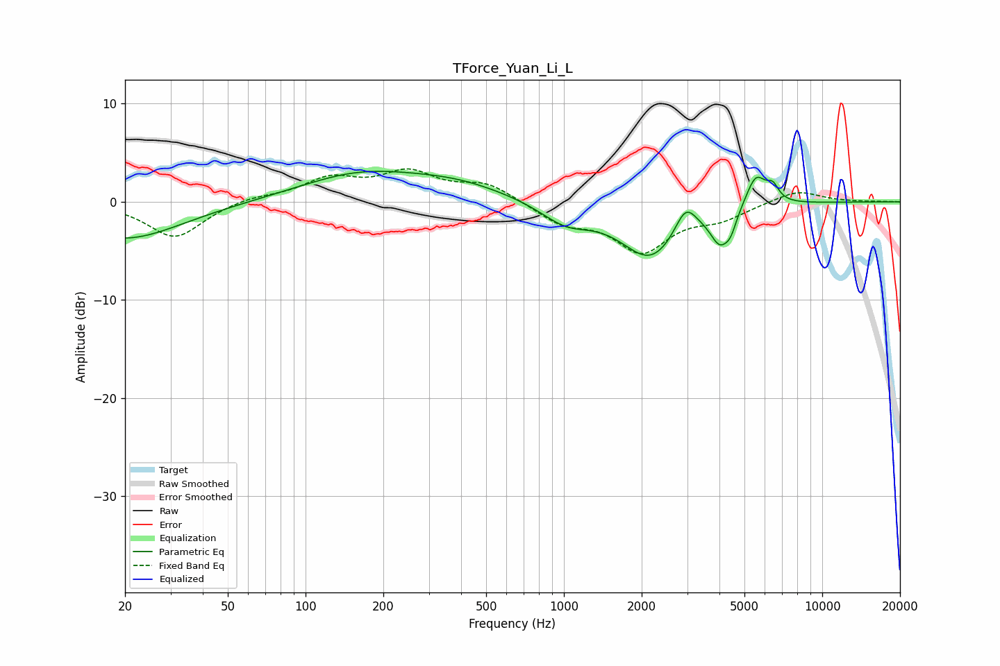

# TForce_Yuan_Li_L
See [usage instructions](https://github.com/jaakkopasanen/AutoEq#usage) for more options and info.

### Parametric EQs
Apply preamp of -3.2 dB when using parametric equalizer.

|   # | Type    |   Fc (Hz) |    Q |   Gain (dB) |
|-----|---------|-----------|------|-------------|
|   1 | Peaking |        20 | 0.64 |        -3.8 |
|   2 | Peaking |       162 | 0.61 |         2.7 |
|   3 | Peaking |       386 | 0.71 |         1.5 |
|   4 | Peaking |      1018 | 1.43 |        -2   |
|   5 | Peaking |      2172 | 1.21 |        -5.6 |
|   6 | Peaking |      2957 | 3.42 |         2.8 |
|   7 | Peaking |      4016 | 3.73 |        -3.2 |
|   8 | Peaking |      4422 | 6    |        -1.5 |
|   9 | Peaking |      5540 | 3.55 |         3.3 |
|  10 | Peaking |      6437 | 6    |         1.4 |

### Fixed Band EQs
When using fixed band (also called graphic) equalizer, apply preamp of **-3.5 dB** (if available) and set gains manually with these parameters.

|   # | Type    |   Fc (Hz) |    Q |   Gain (dB) |
|-----|---------|-----------|------|-------------|
|   1 | Peaking |        31 | 1.41 |        -3.7 |
|   2 | Peaking |        62 | 1.41 |         0.5 |
|   3 | Peaking |       125 | 1.41 |         2.2 |
|   4 | Peaking |       250 | 1.41 |         2.7 |
|   5 | Peaking |       500 | 1.41 |         1.8 |
|   6 | Peaking |      1000 | 1.41 |        -2   |
|   7 | Peaking |      2000 | 1.41 |        -4.8 |
|   8 | Peaking |      4000 | 1.41 |        -1.5 |
|   9 | Peaking |      8000 | 1.41 |         1.3 |
|  10 | Peaking |     16000 | 1.41 |         0   |

### Graphs

