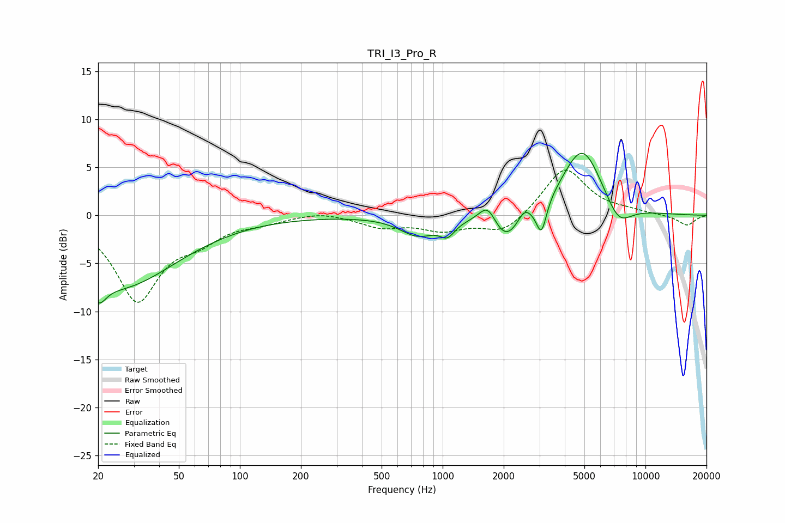

# TRI_I3_Pro_R
See [usage instructions](https://github.com/jaakkopasanen/AutoEq#usage) for more options and info.

### Parametric EQs
Apply preamp of -6.5 dB when using parametric equalizer.

|   # | Type    |   Fc (Hz) |    Q |   Gain (dB) |
|-----|---------|-----------|------|-------------|
|   1 | Peaking |        20 | 3.86 |        -2.3 |
|   2 | Peaking |        26 | 0.5  |        -7.3 |
|   3 | Peaking |       754 | 1.58 |        -2   |
|   4 | Peaking |      1056 | 3.8  |        -1.4 |
|   5 | Peaking |      1672 | 3.17 |         2.4 |
|   6 | Peaking |      2038 | 1.9  |        -3.3 |
|   7 | Peaking |      2527 | 4.4  |         1.2 |
|   8 | Peaking |      3069 | 5.59 |        -3.3 |
|   9 | Peaking |      4886 | 1.37 |         7.3 |
|  10 | Peaking |      7345 | 2.02 |        -2.6 |

### Fixed Band EQs
When using fixed band (also called graphic) equalizer, apply preamp of **-4.8 dB** (if available) and set gains manually with these parameters.

|   # | Type    |   Fc (Hz) |    Q |   Gain (dB) |
|-----|---------|-----------|------|-------------|
|   1 | Peaking |        31 | 1.41 |        -8.7 |
|   2 | Peaking |        62 | 1.41 |        -1.9 |
|   3 | Peaking |       125 | 1.41 |        -0.6 |
|   4 | Peaking |       250 | 1.41 |         0.5 |
|   5 | Peaking |       500 | 1.41 |        -1.1 |
|   6 | Peaking |      1000 | 1.41 |        -1.4 |
|   7 | Peaking |      2000 | 1.41 |        -1.9 |
|   8 | Peaking |      4000 | 1.41 |         5   |
|   9 | Peaking |      8000 | 1.41 |         0.3 |
|  10 | Peaking |     16000 | 1.41 |        -1.1 |

### Graphs

