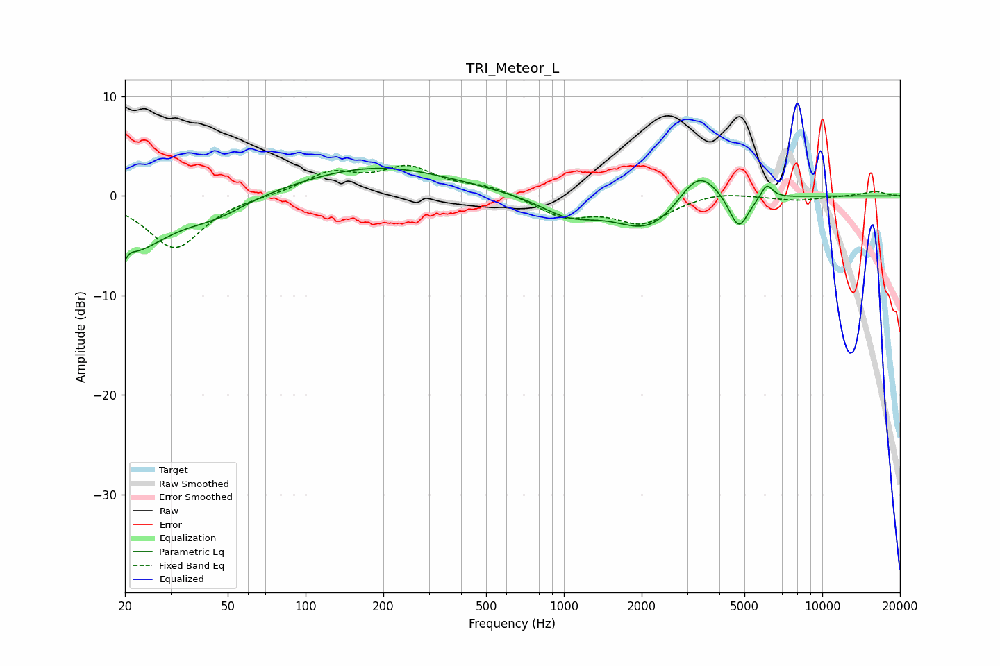

# TRI_Meteor_L
See [usage instructions](https://github.com/jaakkopasanen/AutoEq#usage) for more options and info.

### Parametric EQs
Apply preamp of -2.9 dB when using parametric equalizer.

|   # | Type    |   Fc (Hz) |    Q |   Gain (dB) |
|-----|---------|-----------|------|-------------|
|   1 | Peaking |        20 | 4.85 |        -4.7 |
|   2 | Peaking |        20 | 5.6  |         3.4 |
|   3 | Peaking |        21 | 0.96 |        -4.9 |
|   4 | Peaking |        45 | 1.13 |        -1.5 |
|   5 | Peaking |       189 | 0.48 |         3   |
|   6 | Peaking |      1043 | 1.28 |        -1.8 |
|   7 | Peaking |      2141 | 1.09 |        -3.5 |
|   8 | Peaking |      3321 | 1.81 |         3.7 |
|   9 | Peaking |      4751 | 3.74 |        -3.5 |
|  10 | Peaking |      6102 | 6    |         1.5 |

### Fixed Band EQs
When using fixed band (also called graphic) equalizer, apply preamp of **-3.1 dB** (if available) and set gains manually with these parameters.

|   # | Type    |   Fc (Hz) |    Q |   Gain (dB) |
|-----|---------|-----------|------|-------------|
|   1 | Peaking |        31 | 1.41 |        -5.3 |
|   2 | Peaking |        62 | 1.41 |        -0   |
|   3 | Peaking |       125 | 1.41 |         2.2 |
|   4 | Peaking |       250 | 1.41 |         2.6 |
|   5 | Peaking |       500 | 1.41 |         0.9 |
|   6 | Peaking |      1000 | 1.41 |        -2   |
|   7 | Peaking |      2000 | 1.41 |        -2.6 |
|   8 | Peaking |      4000 | 1.41 |         0.5 |
|   9 | Peaking |      8000 | 1.41 |        -0.5 |
|  10 | Peaking |     16000 | 1.41 |         0.4 |

### Graphs

