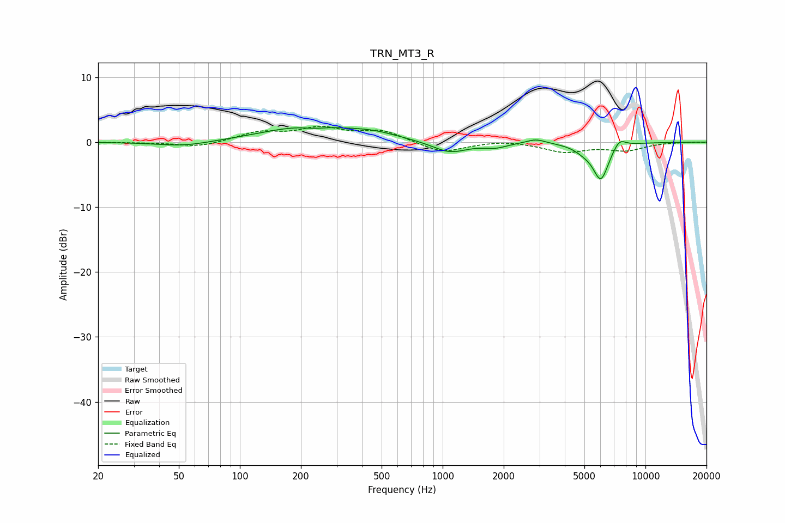

# TRN_MT3_R
See [usage instructions](https://github.com/jaakkopasanen/AutoEq#usage) for more options and info.

### Parametric EQs
Apply preamp of -2.3 dB when using parametric equalizer.

|   # | Type    |   Fc (Hz) |    Q |   Gain (dB) |
|-----|---------|-----------|------|-------------|
|   1 | Peaking |        53 | 1.07 |        -0.7 |
|   2 | Peaking |       213 | 0.64 |         2.3 |
|   3 | Peaking |       233 | 2.65 |        -0.4 |
|   4 | Peaking |       452 | 1.09 |         0.9 |
|   5 | Peaking |      1085 | 1.63 |        -1.7 |
|   6 | Peaking |      1822 | 2.54 |        -0.7 |
|   7 | Peaking |      2883 | 3.05 |         0.7 |
|   8 | Peaking |      4990 | 2.74 |        -0.9 |
|   9 | Peaking |      6029 | 3.54 |        -5.5 |
|  10 | Peaking |      7440 | 4.32 |         1.4 |

### Fixed Band EQs
When using fixed band (also called graphic) equalizer, apply preamp of **-2.5 dB** (if available) and set gains manually with these parameters.

|   # | Type    |   Fc (Hz) |    Q |   Gain (dB) |
|-----|---------|-----------|------|-------------|
|   1 | Peaking |        31 | 1.41 |        -0.1 |
|   2 | Peaking |        62 | 1.41 |        -0.8 |
|   3 | Peaking |       125 | 1.41 |         1.4 |
|   4 | Peaking |       250 | 1.41 |         2   |
|   5 | Peaking |       500 | 1.41 |         1.7 |
|   6 | Peaking |      1000 | 1.41 |        -1.7 |
|   7 | Peaking |      2000 | 1.41 |         0.3 |
|   8 | Peaking |      4000 | 1.41 |        -1.5 |
|   9 | Peaking |      8000 | 1.41 |        -1.2 |
|  10 | Peaking |     16000 | 1.41 |         0   |

### Graphs

