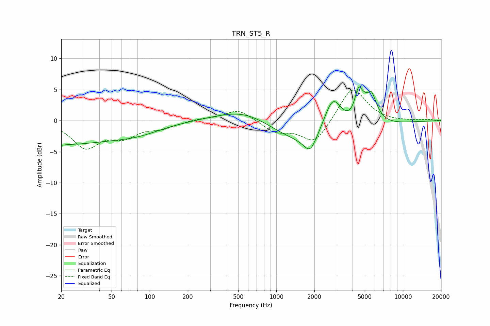

# TRN_ST5_R
See [usage instructions](https://github.com/jaakkopasanen/AutoEq#usage) for more options and info.

### Parametric EQs
Apply preamp of -5.5 dB when using parametric equalizer.

|   # | Type    |   Fc (Hz) |    Q |   Gain (dB) |
|-----|---------|-----------|------|-------------|
|   1 | Peaking |        20 | 5.92 |        -0.2 |
|   2 | Peaking |        20 | 0.34 |        -3.6 |
|   3 | Peaking |        80 | 0.72 |        -1.3 |
|   4 | Peaking |       588 | 0.63 |         2.7 |
|   5 | Peaking |      1853 | 2.85 |        -2.7 |
|   6 | Peaking |      1934 | 0.39 |        -4.5 |
|   7 | Peaking |      2796 | 1.85 |         6.7 |
|   8 | Peaking |      4461 | 4.55 |         4.2 |
|   9 | Peaking |      5311 | 5.97 |        -1.7 |
|  10 | Peaking |      5445 | 2.82 |         6.8 |

### Fixed Band EQs
When using fixed band (also called graphic) equalizer, apply preamp of **-5.0 dB** (if available) and set gains manually with these parameters.

|   # | Type    |   Fc (Hz) |    Q |   Gain (dB) |
|-----|---------|-----------|------|-------------|
|   1 | Peaking |        31 | 1.41 |        -4.2 |
|   2 | Peaking |        62 | 1.41 |        -2.2 |
|   3 | Peaking |       125 | 1.41 |        -1   |
|   4 | Peaking |       250 | 1.41 |         0.3 |
|   5 | Peaking |       500 | 1.41 |         1.9 |
|   6 | Peaking |      1000 | 1.41 |        -1.8 |
|   7 | Peaking |      2000 | 1.41 |        -3.8 |
|   8 | Peaking |      4000 | 1.41 |         5.6 |
|   9 | Peaking |      8000 | 1.41 |        -0.1 |
|  10 | Peaking |     16000 | 1.41 |         0.2 |

### Graphs

