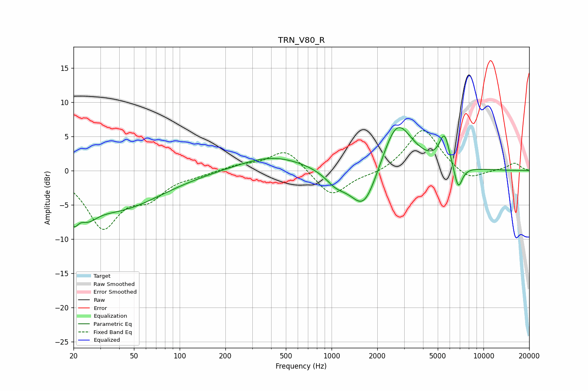

# TRN_V80_R
See [usage instructions](https://github.com/jaakkopasanen/AutoEq#usage) for more options and info.

### Parametric EQs
Apply preamp of -6.4 dB when using parametric equalizer.

|   # | Type    |   Fc (Hz) |    Q |   Gain (dB) |
|-----|---------|-----------|------|-------------|
|   1 | Peaking |        20 | 4.82 |        -3.1 |
|   2 | Peaking |        25 | 2.23 |        -2.3 |
|   3 | Peaking |        38 | 0.48 |        -5.6 |
|   4 | Peaking |       411 | 0.65 |         2.2 |
|   5 | Peaking |      1068 | 2.05 |        -1.7 |
|   6 | Peaking |      1638 | 1.5  |        -6.9 |
|   7 | Peaking |      2691 | 1.37 |         8.1 |
|   8 | Peaking |      5536 | 4.04 |         4.5 |
|   9 | Peaking |      6849 | 4.9  |        -4.7 |
|  10 | Peaking |      6946 | 5.53 |         1.1 |

### Fixed Band EQs
When using fixed band (also called graphic) equalizer, apply preamp of **-5.9 dB** (if available) and set gains manually with these parameters.

|   # | Type    |   Fc (Hz) |    Q |   Gain (dB) |
|-----|---------|-----------|------|-------------|
|   1 | Peaking |        31 | 1.41 |        -8   |
|   2 | Peaking |        62 | 1.41 |        -3.2 |
|   3 | Peaking |       125 | 1.41 |        -0.5 |
|   4 | Peaking |       250 | 1.41 |         0.7 |
|   5 | Peaking |       500 | 1.41 |         3.2 |
|   6 | Peaking |      1000 | 1.41 |        -3.9 |
|   7 | Peaking |      2000 | 1.41 |        -0.6 |
|   8 | Peaking |      4000 | 1.41 |         6.3 |
|   9 | Peaking |      8000 | 1.41 |        -1.7 |
|  10 | Peaking |     16000 | 1.41 |         1.1 |

### Graphs

