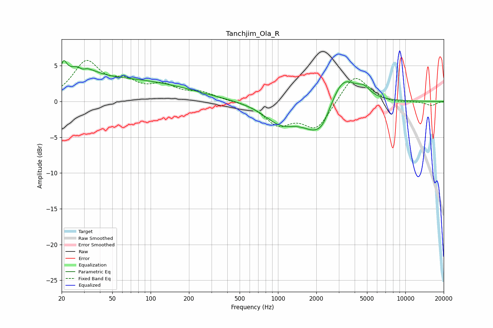

# Tanchjim_Ola_R
See [usage instructions](https://github.com/jaakkopasanen/AutoEq#usage) for more options and info.

### Parametric EQs
Apply preamp of -5.8 dB when using parametric equalizer.

|   # | Type    |   Fc (Hz) |    Q |   Gain (dB) |
|-----|---------|-----------|------|-------------|
|   1 | Peaking |        20 | 5.91 |        -0.1 |
|   2 | Peaking |        21 | 5.95 |         2.2 |
|   3 | Peaking |        27 | 1.33 |         2.4 |
|   4 | Peaking |        29 | 5.99 |        -0.5 |
|   5 | Peaking |        59 | 0.26 |         3   |
|   6 | Peaking |      1048 | 1.11 |        -2.7 |
|   7 | Peaking |      2080 | 1.22 |        -4.7 |
|   8 | Peaking |      2256 | 3.87 |        -0.5 |
|   9 | Peaking |      3190 | 1.32 |         4.7 |
|  10 | Peaking |      4725 | 2.91 |         1.1 |

### Fixed Band EQs
When using fixed band (also called graphic) equalizer, apply preamp of **-5.8 dB** (if available) and set gains manually with these parameters.

|   # | Type    |   Fc (Hz) |    Q |   Gain (dB) |
|-----|---------|-----------|------|-------------|
|   1 | Peaking |        31 | 1.41 |         5.3 |
|   2 | Peaking |        62 | 1.41 |         2.1 |
|   3 | Peaking |       125 | 1.41 |         1.9 |
|   4 | Peaking |       250 | 1.41 |         1.1 |
|   5 | Peaking |       500 | 1.41 |         0.1 |
|   6 | Peaking |      1000 | 1.41 |        -3   |
|   7 | Peaking |      2000 | 1.41 |        -3.8 |
|   8 | Peaking |      4000 | 1.41 |         4   |
|   9 | Peaking |      8000 | 1.41 |        -0.3 |
|  10 | Peaking |     16000 | 1.41 |        -0.6 |

### Graphs

