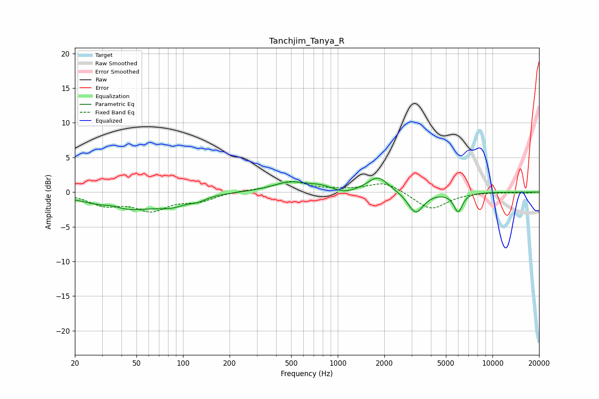

# Tanchjim_Tanya_R
See [usage instructions](https://github.com/jaakkopasanen/AutoEq#usage) for more options and info.

### Parametric EQs
Apply preamp of -2.1 dB when using parametric equalizer.

|   # | Type    |   Fc (Hz) |    Q |   Gain (dB) |
|-----|---------|-----------|------|-------------|
|   1 | Peaking |        35 | 2.14 |         0.7 |
|   2 | Peaking |        39 | 0.75 |        -2.6 |
|   3 | Peaking |        84 | 1.36 |        -1.3 |
|   4 | Peaking |       125 | 2.85 |        -0.5 |
|   5 | Peaking |       497 | 1.2  |         1.4 |
|   6 | Peaking |       777 | 2.2  |         0.5 |
|   7 | Peaking |      1112 | 2.25 |        -0.5 |
|   8 | Peaking |      1818 | 2.13 |         2.2 |
|   9 | Peaking |      3187 | 2.86 |        -3.1 |
|  10 | Peaking |      5994 | 4.91 |        -2.7 |

### Fixed Band EQs
When using fixed band (also called graphic) equalizer, apply preamp of **-1.6 dB** (if available) and set gains manually with these parameters.

|   # | Type    |   Fc (Hz) |    Q |   Gain (dB) |
|-----|---------|-----------|------|-------------|
|   1 | Peaking |        31 | 1.41 |        -1.7 |
|   2 | Peaking |        62 | 1.41 |        -2.4 |
|   3 | Peaking |       125 | 1.41 |        -1.1 |
|   4 | Peaking |       250 | 1.41 |         0.2 |
|   5 | Peaking |       500 | 1.41 |         1.5 |
|   6 | Peaking |      1000 | 1.41 |         0.2 |
|   7 | Peaking |      2000 | 1.41 |         1.5 |
|   8 | Peaking |      4000 | 1.41 |        -2.6 |
|   9 | Peaking |      8000 | 1.41 |         0   |
|  10 | Peaking |     16000 | 1.41 |        -0.1 |

### Graphs

